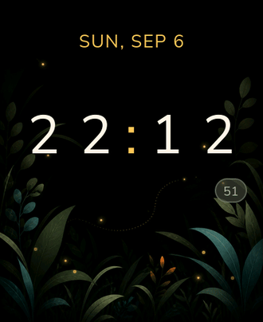
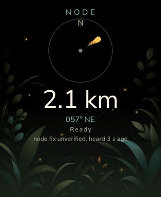
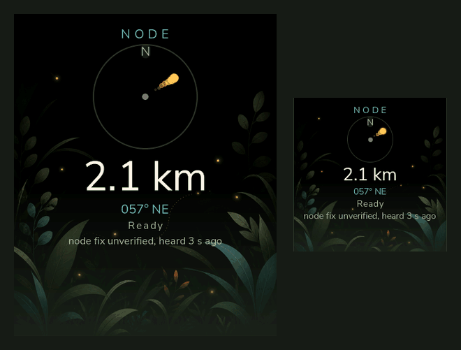

<p align="center">
  
</p>

<p align="center">
  <b>English</b> · <a href="README.ru.md">Русский</a> · <a href="https://hleserg.github.io/Attadipa/">Project page</a>
</p>

<h1 align="center">Atta-dipa</h1>

<p align="center">
  <b>A watch that will not show you what it does not know.</b><br>
  Independent by design — an open ESP32-S3 smartwatch platform<br>
  for LoRa mesh and offline navigation:<br>
  no phone, no cloud, no subscription.
</p>

<p align="center">
  <a href="https://github.com/hleserg/Attadipa/actions/workflows/ci.yml"></a>
  <a href="https://github.com/hleserg/Attadipa/actions/workflows/codeql.yml"></a>
  
  
  <a href="LICENSE"></a>
  <a href="https://github.com/hleserg/Attadipa/discussions"></a>
</p>

<table align="center">
<tr>
<td align="center" width="50%">
  
  <br><sub>The clock face. Original art, and the fireflies are alive.</sub>
</td>
<td align="center" width="50%">
  
  <br><sub>Navigation. Watch what happens when the data runs out.</sub>
</td>
</tr>
</table>

<p align="center">
  <sub>Both captured from the desktop simulator, which renders the same
  application code the watch runs. And the same code on the hardware:</sub>
</p>

<table align="center">
<tr>
<td align="center" width="50%">
  
  <br><sub><b>On the physical watch.</b> Pulled from the live framebuffer over
  Atta-dipa's own debug channel — <a href="docs/hardware/CLOCK_2026-08-26.md">bench
  record</a>. The paw and <code>7777</code> are a layout placeholder, not a step count.</sub>
</td>
<td align="center" width="50%">
  
  <br><sub><b>First boot from flash</b> on the Waveshare ESP32-S3 Touch AMOLED 2.06.</sub>
</td>
</tr>
</table>

<p align="center">
  <a href="#run-it-on-your-desk"><b>Run it in two minutes</b></a> ·
  <a href="#what-works-today"><b>What works today</b></a> ·
  <a href="#help-build-it"><b>Help build it</b></a> ·
  <a href="https://github.com/hleserg/Attadipa/discussions"><b>Open a Discussion</b></a>
</p>

---

## The watch tells you when it does not know

Lose signal, and the usual gadget shows you the last thing it managed to learn
and says nothing about it. The needle points somewhere. The distance reads
`0 m`. It looks like an answer without being one.

Not here. A position in Atta-dipa carries its source, its age and its
confidence, and carries them all the way to the pixel. The navigation screen
has **nine** states, and exactly one of them is an answer:

```
Ready                ← the only one that is an answer

Waiting for GPS      Own position stale       Node unavailable
No fix               Own position degraded    Node position unknown
Receiver silent                               Node position stale
```

Plus three caveats a good day can still carry: *"node fix unverified, heard N
ago"*, *"no receiver on this device"*, *"no position source is set up"*. And
past a thousand kilometres the distance stops pretending to a metre: `> 1000 km`.

No `0 m` standing in for *unknown*. No `(0, 0)`. No arrow pointing somewhere plausible. The animation
above is exactly that, live: when there is nothing to say, the needle
disappears, the numbers become a dash, and an amber line names the specific
thing the watch does not know.

## What it is

**A wearable computer for places with no cellular network** — and a second
device in your pocket or pack when the watch itself lacks the hardware.

- **LoRa messaging** over [MeshCore](https://github.com/meshcore-dev/MeshCore),
  staying an upstream client rather than forking away from it.
- **Navigation without maps** — bearing, great-circle distance, and an honest
  state. Not routes, not tracks, not "you have arrived".
- **An interface worth looking at**, because a watch that is unpleasant to read
  is a watch nobody wears. Twelve colour roles, day and night, WCAG contrast
  arithmetic, and CI that rejects a raw hex value in screen code.
- **Everything local.** No account, no cloud, no mandatory handset.

## One name, two devices

The interesting part of Atta-dipa is that "the watch" is not always one device.

<p align="center">
  
  <br><sub>One set of application code on two very different panels — 410 × 502 and
  240 × 240 — both rendered by the simulator.</sub>
</p>

```
  SELF-CONTAINED                        SPLIT
  one device                            two devices

  T-Watch S3 Plus                       Waveshare AMOLED 2.06
  ├── 240×240 display, touch            ├── 410×502 AMOLED, touch
  ├── GNSS  (MIA-M10Q or LS550G) ✔      └── BLE ──┐   no radio, no receiver
  ├── sub-GHz radio  (part UNKNOWN)                │        on this board
  └── Atta-dipa                                    ▼
                                        Companion node
                                        ├── GNSS
      the wearer and the receiver       └── LoRa / MeshCore
      are on the same body
                                            the coordinate crosses a link,
                                            and the watch says so
```

That is the arrangement, not the state of the firmware. **On hardware today
only the Waveshare runs these screens.** The T-Watch image links the same
`apps/` and `ui/` libraries — one `CMakeLists.txt` links every layer for both
boards — but its board file still brings the panel up rather than starting the
Clock: `firmware/main/twatch_board.cpp:415` — "void build_bringup_screen() {".

The difference is not cosmetic. On the self-contained device the receiver is on
your body, and its coordinate is yours. On the split arrangement the coordinate
comes from a device that **might be lying on a table** — so the watch is not
allowed to quietly present it as your own. That is where the extra states on the
screen come from, and [ADR-0013](docs/adr/0013-node-motion.md).

Applications know about neither arrangement. They ask
`availability(Capability::Position)` — what the device can *do*, never what is
soldered to it — and they cannot even link against the hardware layer: asking a
chip a question from `apps/` is a build error, not a review comment.

## What works today

Status words mean what they say here. `MEASURED` came off hardware or an
instrument; `IMPLEMENTED` runs and is tested, but not on a board yet;
`PLANNED` is a design with no code.

| | State |
|---|---|
| **Boots from flash on a real watch** — AMOLED, capacitive touch, AXP2101 power rails, PCF85063 RTC, and a full [sleep/wake lifecycle](docs/hardware/SLEEP_WAKE_2026-08-26.md) | ✅ `MEASURED` on the Waveshare AMOLED 2.06 |
| **Clock, provisioning and mesh screens on the device** | ✅ `MEASURED` in English ([bench record](docs/hardware/CLOCK_2026-08-26.md)); the firmware still hard-codes `Locale::En`, so a Russian screen on a panel is `NOT EXECUTED` |
| **Talks to a MeshCore node over BLE** — pairs, connects, pins one node by its public key, and shows peers, SNR and the last message received over LoRa | ✅ `MEASURED` against a Heltec T114 ([bench record](docs/research/MESHCORE_T114_FIRST_CONTACT.md)) |
| **Sending a message and seeing the reply on the wrist** | 🧪 `NOT OBSERVED` — the next physical seam |
| **GNSS on the T-Watch S3 Plus** — the module named itself **u-blox MIA-M10Q** ([read off the part](docs/research/HARDWARE_MATRIX.md)), and its NMEA reaches the position service | ✅ `MEASURED` indoors, no fix ([bench log](docs/research/TWATCH_GNSS_LOCAL_BENCH_2026-09-06.md)) |
| **An outdoor fix on that receiver** | 🧪 `NOT EXECUTED — HARDWARE REQUIRED` |
| **Navigation that refuses to invent** — bearing, great-circle distance, staleness and the nine honest states above | ✅ `IMPLEMENTED` and rendering; distance to a *remote* node still needs [#450](https://github.com/hleserg/Attadipa/issues/450) |
| **Desktop simulator**, both geometries, radio and node presence switchable without a rebuild | ✅ `IMPLEMENTED` |
| **Screenshot and drive the live UI from another process** — taps, buttons, scripted journeys | ✅ `MEASURED` on the physical watch for capture, remote tap and the physical touch/BOOT/PWR paths ([bench record](docs/hardware/WATCH_CONTROL_2026-08-25.md)); swipes and scripted journeys so far only on the simulator |
| **Design tokens** — twelve colour roles, day and night, with WCAG contrast arithmetic and a CI check that rejects a raw hex value in screen code | ✅ `IMPLEMENTED` |
| **Fonts that cannot silently fail** — seven Nunito Sans subsets covering exactly the 177 codepoints of the charset; an undrawable character fails the build | ✅ `IMPLEMENTED` |
| **Compass / heading** — the API exists and the screen turns the needle, so far only from simulator fixtures. Neither board ships a magnetometer; two modules are on the bench awaiting a retrofit | 🧪 [`MAGNETOMETER_RETROFIT`](docs/research/MAGNETOMETER_RETROFIT.md) |
| **Haptics** — typed capability descriptors, no driver code yet | 📐 `PLANNED` |
| **Child Mode** — a separate UX for a six-year-old, not the adult UI with bigger fonts | 📐 `PLANNED` |
| **Power** — one honest number: **413 mW** at the Waveshare's USB input, idle on one screen, cell disconnected, 2026-09-05. No sleep figure, no screen-off figure, no per-rail split | 🔬 measuring |
| **The application on the T-Watch S3 Plus** — the image links the same `apps/`, `ui/` and fonts, and its board file starts a panel bring-up instead of the Clock | 🧪 `NOT EXECUTED` — no Atta-dipa screen has run on that board |
| **The T-Watch's sub-GHz radio** — five candidate parts, and only some of them do LoRa at all. Nobody has read the marking off the chip | ❓ `UNKNOWN` ([ADR-0003](docs/adr/0003-radio-not-lora.md)) |

The rows that say `MEASURED` link the bench record that produced them.
[`VERIFIED_FACTS.md`](docs/research/VERIFIED_FACTS.md) is the ledger, and
[`OPEN_QUESTIONS.md`](docs/research/OPEN_QUESTIONS.md) is the list of things
nobody has established yet.

## Right now

Live work as of 2026-09-07. [Issues](https://github.com/hleserg/Attadipa/issues)
and [pull requests](https://github.com/hleserg/Attadipa/pulls) are the real-time
picture.

- **A companion's position on your wrist as a direction** — the vertical slice
  in [#450](https://github.com/hleserg/Attadipa/issues/450): magnetometer,
  heading, BLE payload, navigation service, screen.
- **The T-Watch GNSS** answers over UART at 38400 and names itself; the next
  step is an outdoor fix ([#442](https://github.com/hleserg/Attadipa/issues/442)).
- **Magnetometer retrofit** — two modules on the bench, waiting on an unpowered
  ohmmeter check that decides whether the reset pad needs a wire of its own.
- **Power** — there is a first measured number, and it is the only one.
- **Sending into the mesh** — receive is proven, the reply has not been seen.

## Run it on your desk

You do not need a board. The simulator is a first-class development target
rather than a toy: the same application code, the same screens, both geometries.

```bash
sudo apt install libsdl2-dev            # the one system package this needs
cmake -S . -B build-sim -DATTADIPA_BUILD_SIMULATOR=ON && cmake --build build-sim -j
./build-sim/sim/attadipa_sim --clock --theme night
```

Then it gets interesting:

```bash
S=./build-sim/sim/attadipa_sim
$S --nav --nav-state node-unknown   # the screen when there is nothing to say
$S --nav --nav-state ready --node   # and the same screen with an answer
$S --clock --board t-watch-s3-plus  # the other geometry, 240 × 240
$S --clock --locale ru              # and L toggles it while running
$S --clock --no-bring-up            # leave every part of the hardware untouched
```

`--nav` takes the whole panel, so it does not combine with `--clock`. None of
these need a rebuild — that is the point of them, and it is why one simulator
binary covers both boards. Run the first two back to back: the difference
between them is the fastest way to see what makes this project different from
the others.

Then drive the interface from another terminal — tap it, screenshot it, run a
scripted journey:

```bash
./build-sim/sim/attadipa_sim --clock --debug-socket /tmp/attadipa-sim.sock &
python3 tools/watch_control.py info
python3 tools/watch_control.py screenshot --output /tmp/watch.png
```

The same tool drives the physical watch over USB —
[`WATCH_CONTROL.md`](docs/testing/WATCH_CONTROL.md).

## Help build it

The project needs very different hands, and most of them need no board at all.

| Lane | What there is to do |
|---|---|
| **UI / LVGL** | watch faces, navigation UX, motion, two very different screen geometries |
| **GNSS / navigation** | NMEA and UBX, fix quality, staleness, the honest-state ladder |
| **LoRa / MeshCore** | transport, pairing, upstream compatibility, getting a message delivered |
| **Power** | measurements, sleep, the AXP2101 rail budget — with real instruments |
| **Hardware** | reading schematics, the magnetometer retrofit, reading the marking off the T-Watch radio |
| **Localisation** | the Russian strings exist; carry `Locale::Ru` through to the panel |
| **Documentation** | ADRs, bench reports, this page |
| **Tooling** | the simulator, `watch_control.py`, CI |

**The easiest way to start.** Build the simulator (the two commands above), run
`--nav --nav-state node-unknown` and `--nav --nav-state ready --node`, and look
at the difference.
Then open a [Discussion](https://github.com/hleserg/Attadipa/discussions) and
say what you saw and what you would change. There are no `good first issue`
labels right now — a Discussion is the front door.

Read [CONTRIBUTING.md](CONTRIBUTING.md) before opening a pull request.

## Target hardware

| Board | Role | Radio / GNSS on board |
|---|---|---|
| LilyGO T-Watch S3 Plus | self-contained target | GNSS present — the bench unit's module named itself **MIA-M10Q**, and the product ships that *or* a Quectel LS550G, which needs a different rail ([matrix](docs/research/HARDWARE_MATRIX.md)); radio part **UNKNOWN** |
| Waveshare ESP32-S3 Touch AMOLED 2.06 | split target — the wearable half | **neither**, by design |
| Companion node | separate device — LoRa, GNSS, an ESP32 | provides both, over a link |
| Desktop simulator | first-class development target | simulated, node included |

The Waveshare board having neither radio nor receiver is not an oversight in the
plan. It is the reason the capability layer exists, and it is what keeps this
from being a firmware for one PCB.

Presence is not the whole story either. Both boards have haptics, and they are
**not** the same: one is a PWM motor, the other a DRV2605L with an effect
library. A capability is a *what* and a *how well*, not a checkbox.

## Decisions worth knowing about

The whole set is in [`docs/adr/`](docs/adr/). Five of them explain why the code
looks the way it does:

- **[ADR-0003](docs/adr/0003-radio-not-lora.md)** — do not call the T-Watch
  radio LoRa until somebody reads the marking. Five candidate parts, and some of
  them cannot do LoRa.
- **[ADR-0007](docs/adr/0007-two-capability-layers.md)** — applications ask
  what the device can *do*; what is soldered to it is a separate layer they
  cannot reach.
- **[ADR-0004](docs/adr/0004-capability-sources.md)** — a capability may be
  answered by this board or by a device beside it. The layers that dispatch know
  which; the application deliberately never learns it.
- **[ADR-0013](docs/adr/0013-node-motion.md)** — a node's coordinate does not
  silently become your position.
- **[ADR-0016](docs/adr/0016-one-power-owner.md)** — every rail has exactly one
  owner, and no gating without measurements.

## Building the firmware

ESP-IDF **v5.5.5**, C++17, LVGL **v9.5.0**, FreeRTOS.

```bash
. $IDF_PATH/export.sh     # without this, idf.py is not on PATH
cd firmware
idf.py set-target esp32s3
idf.py build flash monitor
```

The export step, the toolchain versions and what a first flash prints are in
[FIRMWARE_BRINGUP](docs/hardware/FIRMWARE_BRINGUP.md).

Which board an image is composed for is one build-time choice in
`firmware/main/` (`choice ATTADIPA_BOARD`), and that is the only place in the
tree allowed to know which board it is — everything above it asks the board
profile what the device can do.

## Where things live

```
core/          capabilities, position, time, battery — not one register
apps/          screens and services; cannot link against the hardware layer
platform/      the hardware inventory: chips, pins, rails, board profiles
firmware/      the ESP32-S3 composition — the only place that knows the board
sim/           the desktop LVGL simulator
l10n/          strings: English and Russian
docs/adr/      architecture decisions
docs/research/ verified facts, owner decisions, open questions
tools/         watch_control.py, the font generator, the documentation checks
```

## How the project is built

The discipline here is unusual, and you can see it in the code. A hardware fact
is not used until it is traced to a datasheet, a schematic for the named board
revision, vendor source, or a reproducible bench result; otherwise it is written
`UNKNOWN` together with the experiment that would settle it. A test that has not
run on hardware is never a `PASS` — it is `NOT EXECUTED — HARDWARE REQUIRED`. A
citation in a document carries the text of the line it points at, and CI checks
that it still does.

Some of the routine — issue intake, review, the writer gate — is done by agents
in GitHub Actions. That is tooling maintenance rather than the product; the
rules are in [`AGENTS.md`](AGENTS.md) and [`docs/automation/`](docs/automation/).

## License

GPL-3.0-or-later — [`LICENSE`](LICENSE). Copyright and contribution
provenance are in [`COPYRIGHT.md`](COPYRIGHT.md); contributions use the
[DCO 1.1](DCO), with no CLA and no copyright assignment. Third-party components
keep their own licences, each recorded in
[`DEPENDENCIES.md`](docs/research/DEPENDENCIES.md) before anything depends on
it.

---

<p align="center">
  <sub><i>Attadīpa</i> is Pali for "relying on oneself", "having oneself as an
  island and a refuge": <a href="docs/brand/naming.md">about the name</a>.<br>
  Lumar, the firefly on the banner, makes its own light.</sub>
</p>
