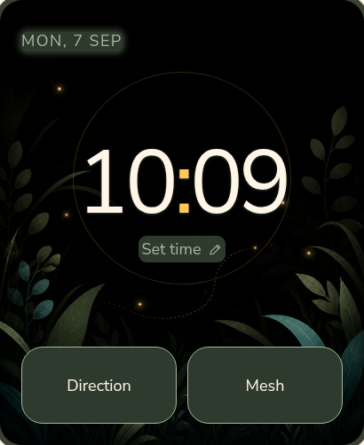
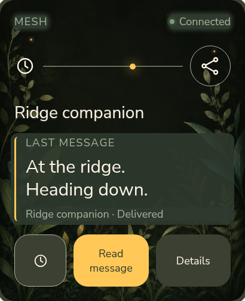
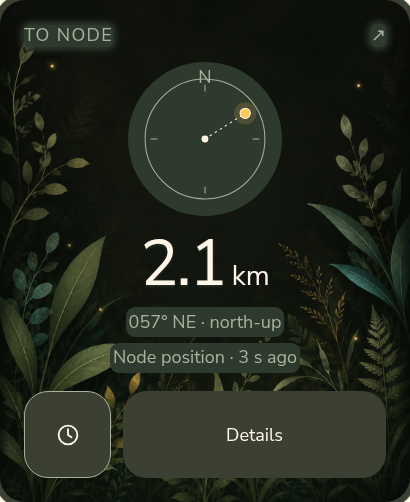

<p align="center">
  
</p>

<p align="center"><b>English</b> · <a href="README.ru.md">Русский</a> · <a href="https://hleserg.github.io/Attadipa/">Meet the project</a></p>

<h1 align="center">Atta-dipa</h1>
<p align="center"><b>An open operating system for wearable devices.</b></p>
<p align="center">Atta-dipa is building a shared foundation for watches, personal mesh nodes and<br>the applications people want to carry with them. Independent by design.</p>
<p align="center"><sub><i>Attadīpa</i> means relying on oneself. <a href="docs/brand/naming.md">About the name</a>.</sub></p>
<p align="center"><a href="#the-os-and-its-architecture">Architecture</a> · <a href="#run-it-on-your-desk">Run the simulator</a> · <a href="#what-works-today">Development status</a> · <a href="#help-build-it">Contribute</a></p>

## One OS. Many possibilities.

A device should be able to grow beyond the functions its manufacturer shipped.
Our ambition is an open common standard for wearable devices and personal
mesh nodes: a platform where people can build applications, bring different
hardware and share what they make.

**Watches are the first embodiment, not the product's boundary.** Time,
messaging and navigation are the first applications. Maps, a recorder,
optional phone pairing and personal tools are directions for the ecosystem
we want to build.

- **Independent operation.** A capability that can run locally should not require a phone, a cloud account or a persistent Internet connection.
- **Applications beyond the original set.** New ideas should build on shared services, instead of starting another board-specific firmware.
- **Different hardware, one platform.** Applications use available capabilities; board providers handle how those capabilities are delivered.
- **An experience worth wearing.** Clear interaction, a coherent visual language and room for personality are part of the OS.

<a id="what-it-is"></a>
<a id="where-things-live"></a>
<a id="decisions-worth-knowing-about"></a>
<a id="how-the-project-is-built"></a>

## The OS and its architecture

The current implementation uses **C++17, ESP-IDF v5.5.5, FreeRTOS and LVGL
v9.5.0**. Atta-dipa supplies the wearable system services, application layer,
device capabilities and interface above that foundation.

| Layer | Responsibility |
|---|---|
| [Applications](apps/) | Product behavior, using system services rather than board registers. |
| [Core services](core/) and [link](link/) | Shared capability, position, time, power and communication interfaces. |
| [Platform](platform/) and [firmware](firmware/) | Hardware profiles, providers and board-specific composition. |
| [UI](ui/), [localisation](l10n/) and [simulator](sim/) | A shared visual language and a desktop environment for development. |

The separation is how the project can grow into an OS for multiple devices
rather than a collection of unrelated firmwares. Hardware access and
application behavior evolve on their own sides of the boundary.
[Architecture decisions](docs/adr/) explain the contracts.

<a id="the-watch-tells-you-when-it-does-not-know"></a>

Services also carry the quality and age of their data. Applications can
distinguish missing, stale and usable information without reinventing those
rules in every screen.

## A first look

The first watch apps share painted landscapes, warm accents and a calm,
glanceable interface. Lumar, our firefly, brings a little of that character
into the project.

<p align="center">
  
  
  
</p>

Interface design previews: Clock · Mesh · Direction. [Image sources](pics/README.md#browser-design-study-captures).

<a id="one-name-two-devices"></a>
<a id="target-hardware"></a>

## Starting with two watches

The first targets are **Waveshare ESP32-S3 Touch AMOLED 2.06** and
**LilyGO T-Watch S3 Plus**, with a desktop simulator for both display geometries.

The platform accommodates both an integrated device and a watch working with
a separate radio node. MeshCore integration connects the watch to a carried
node over BLE for mesh traffic; the wider OS direction also includes our own
nodes. Which capabilities a particular device provides is recorded in the
[hardware matrix](docs/research/HARDWARE_MATRIX.md).

A node carrying the wearer's position and a remote contact's position are
different data sources. The [position-source contract](docs/adr/0020-remote-target-position-source.md)
holds the technical distinction; it is not a separate product identity.

## What works today

**Active development.** Atta-dipa boots on real hardware; system services,
the interface and radio integration are being developed together. The aim is
a shared app/device platform, not a finished app marketplace. Navigation is
experimental and must not be relied on for safety-critical use.

The table below records the scope of the linked bench results, not a claim
that every design preview is already running on a watch.

<details>
<summary>Implementation and bench evidence · 9 September 2026</summary>

| Area | What the evidence supports |
|---|---|
| **Waveshare on the bench** | Boot from flash and the Clock are **MEASURED** in the [August 25 bring-up](docs/hardware/BRINGUP_2026-08-25.md) and [August 26 Clock report](docs/hardware/CLOCK_2026-08-26.md). These are dated prototype results, not acceptance of the new browser design. |
| **MeshCore connection and messages** | Pairing and received messages on the watch are **MEASURED**. A debug-command send was confirmed through a Heltec V4.3 OLED; T114 delivery confirmation was **NOT OBSERVED**. This does not prove a watch composer or a complete reply journey. [Bench report](docs/research/MESHCORE_T114_FIRST_CONTACT.md). |
| **Navigation and GNSS** | Software readouts handle missing and stale information. The T-Watch receiver's NMEA and indoor **NoFix** were observed; an outdoor fix is **NOT EXECUTED — HARDWARE REQUIRED**. A complete remote-contact navigation journey and a working physical compass are not established. [GNSS evidence](docs/research/TWATCH_GNSS_LOCAL_BENCH_2026-09-06.md), [target contract](docs/adr/0020-remote-target-position-source.md). |
| **T-Watch display and touch** | Panel and touch bring-up are **MEASURED** on the bench unit. This is not Clock/Mesh/Nav application acceptance on that watch. [September 3 report](docs/research/TWATCH_S3_PLUS_PANEL_TOUCH_2026-09-03.md). |
| **Desktop and design review** | A desktop LVGL simulator and separate interactive browser studies exist for both geometries. Neither is hardware evidence. [Simulator controls](docs/testing/WATCH_CONTROL.md), [browser study](docs/ui/prototype/index.html). |

</details>

<a id="right-now"></a>

See [Issues](https://github.com/hleserg/Attadipa/issues) and
[pull requests](https://github.com/hleserg/Attadipa/pulls) for current work,
and the [roadmap](docs/ROADMAP.md) for development priorities.

## Run it on your desk

For the actual native UI code, use the desktop simulator. You need **Git,
CMake 3.20+, a C++17 compiler and SDL2 development files**. The first simulator
configuration fetches the pinned LVGL source unless supplied locally.

```bash
# Debian / Ubuntu prerequisites
sudo apt install build-essential cmake git libsdl2-dev
cmake -S . -B build-sim -DATTADIPA_BUILD_SIMULATOR=ON
cmake --build build-sim -j
./build-sim/sim/attadipa_sim --clock --theme night
```

Try `--clock --locale ru`, `--clock --board waveshare-amoled-206`, or
`--nav --nav-state node-unknown`. Clock and Nav are alternative screen modes.
For scripted taps and screenshots, see [Watch Control](docs/testing/WATCH_CONTROL.md).

<a id="building-the-firmware"></a>

For physical boards, follow [Firmware bring-up](docs/hardware/FIRMWARE_BRINGUP.md)
and [bench handling](docs/hardware/BENCH_HANDLING.md), including backup and
board identification before flashing. Firmware uses ESP-IDF **v5.5.5**;
the native UI uses LVGL **v9.5.0**. A successful build is not a hardware test.

## Help build it

You do not need to own a watch to contribute.

| Start here | A useful first contribution |
|---|---|
| **Design and accessibility** | Try a small-screen journey and show where it becomes hard to read or use. [Design system](docs/ui/DESIGN_SYSTEM.md). |
| **Software** | Run the simulator, reproduce a scoped issue, improve a tested application path. [Contributing](CONTRIBUTING.md). |
| **Hardware and radio** | Bring a traceable bench observation, protocol capture or measurement — with its limits. [Research rules](docs/research/AGENTS.md). |
| **Words and localisation** | Make a screen or document clearer in English and Russian. [String catalogue](l10n/strings.toml). |

Start with an [open issue](https://github.com/hleserg/Attadipa/issues) or
[Discussion](https://github.com/hleserg/Attadipa/discussions). Read
[CONTRIBUTING.md](CONTRIBUTING.md) before a PR; coordinate claimed work so
another contributor is not solving the same task.

<details>
<summary>Design workspace</summary>

## Try the design

No board or firmware toolchain needed. From a clone of this repository,
serve the study using Python 3:

```bash
python3 -m http.server 8481 --bind 127.0.0.1 --directory docs/ui
```

Open **http://127.0.0.1:8481/prototype/**. Switch size, theme and language; try the
controls inside the screens. **[Shell Study 03](docs/ui/prototype/SHELL_STUDY_03.md)**
at **http://127.0.0.1:8481/prototype/shell.html** explores the app launcher, Settings and
separate watch/node status. These are review tools with sample data, not firmware.
They do not access a watch, radio or device storage.

</details>

## License

**GPL-3.0-or-later** — [LICENSE](LICENSE). Copyright and contribution
provenance: [COPYRIGHT.md](COPYRIGHT.md). Contributions use [DCO 1.1](DCO),
with no CLA or copyright assignment. Third-party licences are recorded in
[DEPENDENCIES.md](docs/research/DEPENDENCIES.md).
