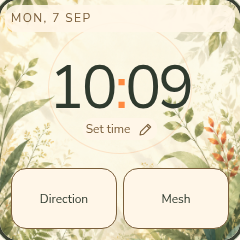
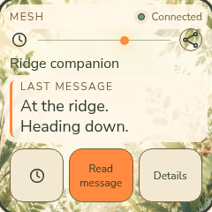
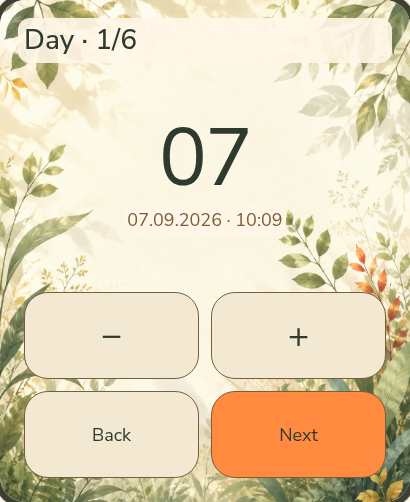

<p align="center">
  
</p>

<p align="center">
  <b>English</b> · <a href="README.ru.md">Русский</a> · <a href="https://hleserg.github.io/Attadipa/">Project page</a>
</p>

<h1 align="center">An open watch. A world to explore.</h1>

<p align="center">
  Attadipa is an open-source wearable project for keeping time,<br>
  finding direction and staying in touch beyond cellular coverage.<br>
  Built around local operation, a beautiful interface, and hardware you can understand.
</p>

<p align="center">
  <a href="#try-the-design"><b>Explore the design</b></a> ·
  <a href="#what-works-today">What works today</a> ·
  <a href="#help-build-it">Help build it</a>
</p>

**Early development, not a finished consumer watch.** Some functions have run
on physical hardware; others are software or design studies. Attadipa is not
ready to be relied on for safety-critical navigation.

## A little light on your wrist

Painted landscapes, a warm orange accent, large readable numbers and a few
fireflies. The aim is an instrument you can read in a glance — and enjoy wearing.

**Browser design study · sample data · not firmware screenshots.** These
captures show the approved visual direction, not proof that a feature works
on a watch. [Capture source and reproduction notes](pics/README.md#browser-design-study-captures).

<p align="center">
  
  
  
</p>

<p align="center"><sub>Clock · Direction · Mesh. Original image size: 410 × 502; displayed smaller here.</sub></p>

<a id="what-it-is"></a>

## More than a watch face

- **Useful without a phone or cloud.** Time, local controls, navigation and mesh communication are the focus; an account or subscription should not stand between you and your own device.
- **Your people, beyond cellular coverage.** MeshCore integration is the route to radio messaging through a carried node. The complete wrist messaging experience is still being built.
- **One watch, room to grow.** Clock, Navigation, Mesh and Settings belong to one interface. More apps should fit naturally, including community contributions — there is no released app marketplace or third-party app SDK yet.
- **A clear answer, including “I don't know.”** Missing positions, stale information and an unverified fix must stay visible, not disappear behind an attractive arrow.

<a id="the-watch-tells-you-when-it-does-not-know"></a>

When position data is missing, distance becomes a dash. When it is old, the
screen says so. A bearing from north is not presented as a live compass heading.
These distinctions are part of the [design system](docs/ui/DESIGN_SYSTEM.md),
not optional debug information.

## A smaller screen is a different composition

The 240 × 240 layout is designed separately, not shrunk from the larger panel.
Day and night belong to the same visual world; time can be set on the watch itself.

**Browser studies below; all values and outcomes are simulated.**

<p align="center">
  
  
  
</p>

<p align="center"><sub>Small Clock · Small Mesh · Time editor on the larger layout.</sub></p>

<a id="one-name-two-devices"></a>
<a id="target-hardware"></a>

## One experience, two device arrangements

The project targets **LilyGO T-Watch S3 Plus** and **Waveshare ESP32-S3 Touch
AMOLED 2.06**, with a desktop simulator for both screen sizes. Hardware
identification and revision limits live in the [hardware matrix](docs/research/HARDWARE_MATRIX.md).

The intended split arrangement is a watch plus a node you carry. That node
connects over BLE, carries mesh traffic and may provide GNSS observations.
It is **not** the remote person you want to navigate to:

```text
Carried node → BLE → your watch             your connection / possible own-position source
Remote contact → Mesh → carried node → BLE  the other person's position and messages
```

This is the [product and architecture direction](docs/adr/0020-remote-target-position-source.md),
not a claim that the full journey ships today. An upstream node's coordinates
alone are not trusted GNSS evidence. Raw observations, confidence checks and
remote-target selection still need their implementation and validation.

## What works today

Evidence snapshot: **9 September 2026**. A browser image, a desktop test and
a physical observation are three different kinds of evidence.

| Area | What the evidence supports |
|---|---|
| **Waveshare on the bench** | Boot from flash and the Clock are **MEASURED** in the [August 25 bring-up](docs/hardware/BRINGUP_2026-08-25.md) and [August 26 Clock report](docs/hardware/CLOCK_2026-08-26.md). These are dated prototype results, not acceptance of the new browser design. |
| **MeshCore connection and messages** | Pairing and received messages on the watch are **MEASURED**. A debug-command send was confirmed through a Heltec V4.3 OLED; T114 delivery confirmation was **NOT OBSERVED**. This does not prove a watch composer or a complete reply journey. [Bench report](docs/research/MESHCORE_T114_FIRST_CONTACT.md). |
| **Navigation and GNSS** | Software readouts handle missing and stale information. The T-Watch receiver's NMEA and indoor **NoFix** were observed; an outdoor fix is **NOT EXECUTED — HARDWARE REQUIRED**. A complete remote-contact navigation journey and a working physical compass are not established. [GNSS evidence](docs/research/TWATCH_GNSS_LOCAL_BENCH_2026-09-06.md), [target contract](docs/adr/0020-remote-target-position-source.md). |
| **T-Watch display and touch** | Panel and touch bring-up are **MEASURED** on the bench unit. This is not Clock/Mesh/Nav application acceptance on that watch. [September 3 report](docs/research/TWATCH_S3_PLUS_PANEL_TOUCH_2026-09-03.md). |
| **Desktop and design review** | A desktop LVGL simulator and separate interactive browser studies exist for both geometries. Neither is hardware evidence. [Simulator controls](docs/testing/WATCH_CONTROL.md), [browser study](docs/ui/prototype/index.html). |

### Earlier physical evidence

<p align="center">
  
  
</p>

The left image is a **live framebuffer capture, not a photograph of the panel**.
Its paw and `7777` are layout placeholders, not a measured step count. The right
image records an earlier physical first boot. Neither shows the new browser UI
running on hardware. See the [Clock record](docs/hardware/CLOCK_2026-08-26.md)
and [asset provenance](pics/README.md).

<a id="right-now"></a>

Current work and blockers belong in [Issues](https://github.com/hleserg/Attadipa/issues)
and [pull requests](https://github.com/hleserg/Attadipa/pulls).
The [roadmap](docs/ROADMAP.md) holds the longer-term direction. Maps, phone
pairing, a recorder, voice input and additional local apps are future
possibilities, not a list of released features.

## Try the design

No board or firmware toolchain needed. From a clone of this repository,
serve the study using Python 3:

```bash
python3 -m http.server 8481 --bind 127.0.0.1 --directory docs/ui
```

Open **http://127.0.0.1:8481/prototype/**. Switch size, theme and language; try the
controls inside the screens. **[Shell Study 03](docs/ui/prototype/SHELL_STUDY_03.md)**
at **http://127.0.0.1:8481/prototype/shell.html** explores the app launcher, Settings and
separate watch/node status. These are review tools with sample data, not firmware.
They do not access a watch, radio or device storage.

## Run it on your desk

For the actual native UI code, use the desktop simulator. You need **Git,
CMake 3.20+, a C++17 compiler and SDL2 development files**. The first simulator
configuration fetches the pinned LVGL source unless supplied locally.

```bash
# Debian / Ubuntu prerequisites
sudo apt install build-essential cmake git libsdl2-dev
cmake -S . -B build-sim -DATTADIPA_BUILD_SIMULATOR=ON
cmake --build build-sim -j
./build-sim/sim/attadipa_sim --clock --theme night
```

Try `--clock --locale ru`, `--clock --board waveshare-amoled-206`, or
`--nav --nav-state node-unknown`. Clock and Nav are alternative screen modes.
For scripted taps and screenshots, see [Watch Control](docs/testing/WATCH_CONTROL.md).

<a id="building-the-firmware"></a>

For physical boards, follow [Firmware bring-up](docs/hardware/FIRMWARE_BRINGUP.md)
and [bench handling](docs/hardware/BENCH_HANDLING.md), including backup and
board identification before flashing. Firmware uses ESP-IDF **v5.5.5**;
the native UI uses LVGL **v9.5.0**. A successful build is not a hardware test.

## Help build it

You do not need to own a watch to contribute.

| Start here | A useful first contribution |
|---|---|
| **Design and accessibility** | Try a small-screen journey and show where it becomes hard to read or use. [Design system](docs/ui/DESIGN_SYSTEM.md). |
| **Software** | Run the simulator, reproduce a scoped issue, improve a tested application path. [Contributing](CONTRIBUTING.md). |
| **Hardware and radio** | Bring a traceable bench observation, protocol capture or measurement — with its limits. [Research rules](docs/research/AGENTS.md). |
| **Words and localisation** | Make a screen or document clearer in English and Russian. [String catalogue](l10n/strings.toml). |

Start with an [open issue](https://github.com/hleserg/Attadipa/issues) or
[Discussion](https://github.com/hleserg/Attadipa/discussions). Read
[CONTRIBUTING.md](CONTRIBUTING.md) before a PR; coordinate claimed work so
another contributor is not solving the same task.

<a id="where-things-live"></a>
<a id="decisions-worth-knowing-about"></a>
<a id="how-the-project-is-built"></a>

The code is organised into [core services](core/), [applications](apps/),
[native UI](ui/), [board composition](firmware/) and [simulator](sim/).
[ADRs](docs/adr/) explain the boundaries; [verified facts](docs/research/VERIFIED_FACTS.md)
record what hardware evidence actually establishes. Applications ask what a
device can do, not which board it is.

## License

**GPL-3.0-or-later** — [LICENSE](LICENSE). Copyright and contribution
provenance: [COPYRIGHT.md](COPYRIGHT.md). Contributions use [DCO 1.1](DCO),
with no CLA or copyright assignment. Third-party components keep their own
licences, recorded in [DEPENDENCIES.md](docs/research/DEPENDENCIES.md).

<p align="center"><sub><i>Attadīpa</i>: relying on oneself, an island and a refuge.
<a href="docs/brand/naming.md">About the name</a>.<br>
Lumar, the firefly on the banner, makes its own light.</sub></p>
