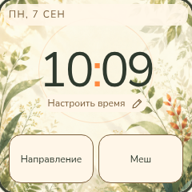
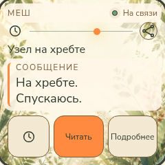
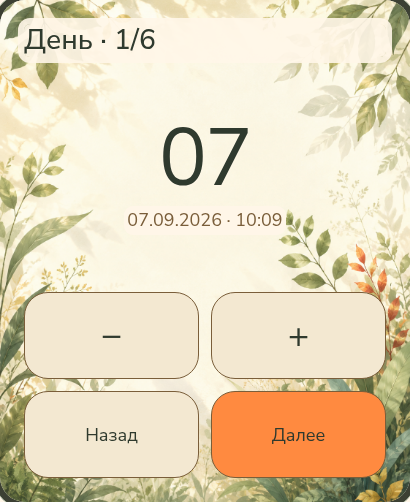

<p align="center">
  
</p>

<p align="center">
  <a href="README.md">English</a> · <b>Русский</b> · <a href="https://hleserg.github.io/Attadipa/">Страница проекта</a>
</p>

<h1 align="center">Открытые часы. Большой мир впереди.</h1>

<p align="center">
  Attadipa — открытый проект носимого устройства, чтобы следить за временем,<br>
  находить направление и оставаться на связи вне покрытия сотовой сети.<br>
  В основе — работа без облака, красивый интерфейс и понятное владельцу устройство.
</p>

<p align="center">
  <a href="#попробовать-дизайн"><b>Посмотреть дизайн</b></a> ·
  <a href="#что-работает-сегодня">Что работает сегодня</a> ·
  <a href="#чем-помочь">Чем помочь</a>
</p>

**Ранняя разработка, не готовые потребительские часы.** Часть функций уже
работала на физических устройствах; другая часть существует в коде или
макетах. На Attadipa пока нельзя полагаться в навигации, от которой зависит
безопасность.

## Немного света на запястье

Нарисованные пейзажи, тёплый оранжевый акцент, крупные читаемые цифры и
несколько светлячков. Мы хотим сделать инструмент, понятный с одного взгляда,
который ещё и приятно носить.

**Браузерный макет · условные данные · не скриншоты прошивки.** Эти кадры
показывают согласованное визуальное направление, а не доказывают работу
функций на часах. [Исходник и воспроизведение кадров](pics/README.md#browser-design-study-captures).

<p align="center">
  
  
  
</p>

<p align="center"><sub>Часы · Направление · Меш. Исходные кадры: 410 × 502; здесь показаны уменьшенными.</sub></p>

<a id="что-это-такое"></a>

## Больше, чем циферблат

- **Польза без телефона и облака.** Время, управление на устройстве, навигация и меш-связь — основа проекта. Учётная запись или подписка не должны отделять человека от его собственных часов.
- **Свои люди вне сотовой сети.** Интеграция с MeshCore ведёт к радиосообщениям через носимую ноду. Полный сценарий переписки с запястья ещё разрабатывается.
- **Одни часы с местом для нового.** Часы, Навигация, Меш и Настройки — части одного интерфейса. Новые приложения, в том числе от сообщества, должны вписываться в него естественно. Выпущенного магазина приложений или SDK для сторонних приложений пока нет.
- **Понятный ответ, в том числе «не знаю».** Отсутствующая позиция, старые данные и непроверенная фиксация не должны прятаться за красивой стрелкой.

<a id="часы-говорят-когда-не-знают"></a>

Если позиции нет, вместо расстояния будет прочерк. Если данные устарели,
экран об этом скажет. Азимут от севера не выдаётся за живой компасный курс.
Это часть [дизайн-системы](docs/ui/DESIGN_SYSTEM.md), а не необязательная
отладочная информация.

## Маленький экран — другая композиция

Интерфейс 240 × 240 проектируется отдельно, а не уменьшается с большого
экрана. День и ночь остаются одним визуальным миром; время можно настроить
на самих часах.

**Ниже браузерные макеты; все значения и результаты смоделированы.**

<p align="center">
  
  
  
</p>

<p align="center"><sub>Маленькие Часы · Маленький Меш · Редактор времени на большом экране.</sub></p>

<a id="одно-имя-два-устройства"></a>
<a id="целевое-железо"></a>

## Один интерфейс, две схемы устройства

Проект ориентирован на **LilyGO T-Watch S3 Plus** и **Waveshare ESP32-S3 Touch
AMOLED 2.06**; для обоих размеров экрана есть настольный симулятор. Что
подтверждено о железе и его ревизиях — в [матрице оборудования](docs/research/HARDWARE_MATRIX.md).

Разнесённая схема задумана как часы и нода, которую вы носите с собой. Нода
подключается по BLE, передаёт меш-трафик и может предоставлять наблюдения GNSS.
Это **не** удалённый человек, к которому вы хотите идти:

```text
Носимая нода → BLE → ваши часы             ваша связь / возможный источник своей позиции
Удалённый контакт → Меш → нода → BLE       позиция и сообщения другого человека
```

Это [продуктовое и архитектурное направление](docs/adr/0020-remote-target-position-source.md),
а не утверждение, что весь сценарий уже готов. Одни координаты от ноды с
обычной прошивкой не считаются доверенным доказательством GNSS. Сырые
наблюдения, проверки доверия и выбор удалённой цели ещё требуют реализации
и проверки.

## Что работает сегодня

Срез доказательств: **9 сентября 2026 года**. Картинка из браузера, настольный
тест и наблюдение на физических часах — три разных вида подтверждения.

| Область | Что подтверждают материалы |
|---|---|
| **Waveshare на стенде** | Загрузка из flash и Часы — **MEASURED**, в [отчёте 25 августа](docs/hardware/BRINGUP_2026-08-25.md) и [отчёте о Часах 26 августа](docs/hardware/CLOCK_2026-08-26.md). Это датированные результаты прототипа, не приёмка нового браузерного дизайна. |
| **MeshCore и сообщения** | Сопряжение и приём сообщений на часах — **MEASURED**. Отправка через отладочную команду подтверждена с Heltec V4.3 OLED; подтверждение доставки с T114 — **NOT OBSERVED**. Это не доказывает готовый экран ввода или полный сценарий ответа с часов. [Стендовый отчёт](docs/research/MESHCORE_T114_FIRST_CONTACT.md). |
| **Навигация и GNSS** | Программный интерфейс учитывает отсутствие и устаревание данных. Наблюдались NMEA от приёмника T-Watch и **NoFix** в помещении; фиксация под открытым небом — **NOT EXECUTED — HARDWARE REQUIRED**. Полный путь к удалённому контакту и работающий физический компас не подтверждены. [GNSS на стенде](docs/research/TWATCH_GNSS_LOCAL_BENCH_2026-09-06.md), [контракт цели](docs/adr/0020-remote-target-position-source.md). |
| **Экран и тач T-Watch** | Поднятие панели и тача — **MEASURED** на стендовом экземпляре. Это не приёмка приложений Часы/Меш/Навигация на этих часах. [Отчёт 3 сентября](docs/research/TWATCH_S3_PLUS_PANEL_TOUCH_2026-09-03.md). |
| **Настольная разработка и дизайн** | Есть настольный LVGL-симулятор и отдельные интерактивные браузерные макеты для обеих геометрий. Ни то ни другое не доказывает работу на железе. [Управление симулятором](docs/testing/WATCH_CONTROL.md), [макет](docs/ui/prototype/index.html). |

### Более ранние кадры с физических часов

<p align="center">
  
  
</p>

Слева — **живой фреймбуфер, не фотография панели**. Лапка и `7777` в нём —
заглушки вёрстки, не измеренные шаги. Справа — запись более ранней первой
загрузки физических часов. Ни один кадр не показывает новый браузерный UI
на железе. См. [запись о Часах](docs/hardware/CLOCK_2026-08-26.md)
и [происхождение файлов](pics/README.md).

<a id="прямо-сейчас"></a>

Текущие задачи и блокировки — в [Issues](https://github.com/hleserg/Attadipa/issues)
и [pull requests](https://github.com/hleserg/Attadipa/pulls).
Долгосрочное направление — в [дорожной карте](docs/ROADMAP.md). Карты,
сопряжение с телефоном, диктофон, голосовой ввод и дополнительные локальные
приложения — будущие возможности, не список выпущенных функций.

## Попробовать дизайн

Плата и инструменты сборки прошивки не нужны. Из клона репозитория запустите
сервер макета с помощью Python 3:

```bash
python3 -m http.server 8481 --bind 127.0.0.1 --directory docs/ui
```

Откройте **http://127.0.0.1:8481/prototype/**. Переключайте размер, тему и язык;
попробуйте кнопки внутри экранов. **[Shell Study 03](docs/ui/prototype/SHELL_STUDY_03.md)**
по адресу **http://127.0.0.1:8481/prototype/shell.html** показывает меню приложений,
Настройки и раздельный статус часов и ноды. Это инструменты согласования
с условными данными, не прошивка. Они не обращаются к часам, радио или
хранилищу устройства.

## Попробовать на своём столе

Настоящий нативный код интерфейса работает в настольном симуляторе. Нужны
**Git, CMake 3.20+, компилятор C++17 и файлы разработки SDL2**. Первая
конфигурация симулятора загружает закреплённые исходники LVGL, если не
указать их локальную копию.

```bash
# Зависимости Debian / Ubuntu
sudo apt install build-essential cmake git libsdl2-dev
cmake -S . -B build-sim -DATTADIPA_BUILD_SIMULATOR=ON
cmake --build build-sim -j
./build-sim/sim/attadipa_sim --clock --theme night
```

Попробуйте `--clock --locale ru`, `--clock --board waveshare-amoled-206` или
`--nav --nav-state node-unknown`. Часы и Навигация — альтернативные режимы
экрана. Тапы и скриншоты из скриптов описаны в [Watch Control](docs/testing/WATCH_CONTROL.md).

<a id="сборка-прошивки"></a>

Для физических плат следуйте [инструкции запуска прошивки](docs/hardware/FIRMWARE_BRINGUP.md)
и [правилам работы на стенде](docs/hardware/BENCH_HANDLING.md): сначала
идентификация платы и резервная копия, потом прошивка. Используется ESP-IDF
**v5.5.5**, в нативном UI — LVGL **v9.5.0**. Успешная сборка не является
аппаратным испытанием.

## Чем помочь

Для участия необязательно владеть часами.

| Начать здесь | Первый полезный вклад |
|---|---|
| **Дизайн и доступность** | Пройти сценарий на маленьком экране и показать, где трудно читать или нажимать. [Дизайн-система](docs/ui/DESIGN_SYSTEM.md). |
| **Разработка** | Запустить симулятор, воспроизвести конкретную задачу, улучшить проверяемый сценарий приложения. [Участие](CONTRIBUTING.md). |
| **Железо и радио** | Принести воспроизводимое наблюдение на стенде, протокольный захват или измерение — с явными ограничениями. [Правила исследования](docs/research/AGENTS.md). |
| **Текст и локализация** | Сделать экран или документ понятнее по-английски и по-русски. [Каталог строк](l10n/strings.toml). |

Начните с [открытой задачи](https://github.com/hleserg/Attadipa/issues) или
[Discussion](https://github.com/hleserg/Attadipa/discussions). Перед PR прочтите
[CONTRIBUTING.md](CONTRIBUTING.md); согласуйте занятую работу, чтобы не решать
одну задачу одновременно с другим участником.

<a id="что-где-лежит"></a>
<a id="решения-которые-стоит-знать"></a>
<a id="как-этот-проект-делается"></a>

Код разделён на [базовые сервисы](core/), [приложения](apps/),
[нативный UI](ui/), [сборку компонентов платы](firmware/) и [симулятор](sim/).
[ADR](docs/adr/) объясняют границы, а [проверенные факты](docs/research/VERIFIED_FACTS.md)
фиксируют, что действительно доказано на железе. Приложения спрашивают,
что устройство умеет, а не какая в нём плата.

## Лицензия

**GPL-3.0-or-later** — [LICENSE](LICENSE). Авторство и происхождение вкладов —
[COPYRIGHT.md](COPYRIGHT.md). Используется [DCO 1.1](DCO), без CLA и передачи
авторских прав. Сторонние компоненты сохраняют свои лицензии, перечисленные
в [DEPENDENCIES.md](docs/research/DEPENDENCIES.md).

<p align="center"><sub><i>Attadīpa</i>: опора на себя, остров и прибежище.
<a href="docs/brand/naming.md">Об имени</a>.<br>
Люмар, светлячок на баннере, светит сам.</sub></p>
