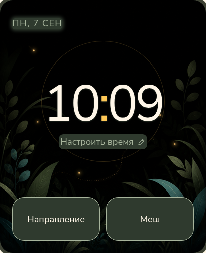
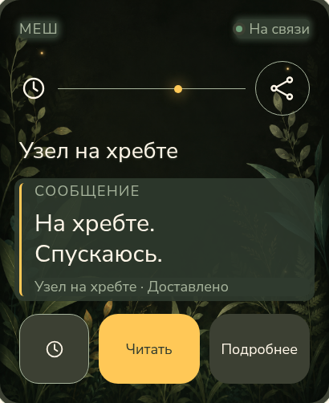
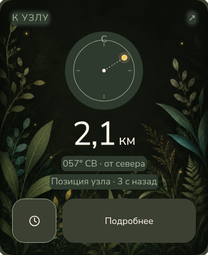

<p align="center">
  
</p>

<p align="center"><a href="README.md">English</a> · <b>Русский</b> · <a href="https://hleserg.github.io/Attadipa/?lang=ru">Знакомство с проектом</a></p>

<h1 align="center">Attadipa</h1>
<p align="center"><b>Открытая операционная система для носимых устройств.</b></p>
<p align="center">Attadipa — общая основа для часов, персональных меш-нод<br>и приложений, которые хочется носить с собой. Independent by design.</p>
<p align="center"><sub><i>Attadīpa</i> — «опора на самого себя». <a href="docs/brand/naming.md">О названии</a>.</sub></p>
<p align="center"><a href="#ос-и-её-архитектура">Архитектура</a> · <a href="#попробовать-на-своём-столе">Запустить симулятор</a> · <a href="#что-работает-сегодня">Состояние разработки</a> · <a href="#чем-помочь">Участвовать</a></p>

## Одна ОС. Много возможностей.

Устройство должно развиваться за пределами функций, с которыми его выпустил
производитель. Наша цель — общий открытый стандарт для носимых устройств и
персональных меш-нод: платформа, для которой можно создавать приложения,
подключать разное оборудование и делиться результатами.

**Часы — первое воплощение, а не граница проекта.** Время, связь и навигация —
первые приложения. Карты, диктофон, сопряжение с телефоном по желанию и личные
инструменты — направления развития будущей экосистемы.

- **Самостоятельная работа.** То, что может работать локально, не должно требовать телефона, облачного аккаунта или постоянного интернета.
- **Приложения за пределами первоначального набора.** Новые идеи должны опираться на общие сервисы, а не начинаться с отдельной прошивки под конкретную плату.
- **Разное оборудование, одна платформа.** Приложения используют доступные возможности; аппаратные провайдеры отвечают за их реализацию.
- **Интерфейс, который хочется носить.** Понятное управление, единый визуальный язык и собственный характер — часть ОС.

<a id="что-это-такое"></a>
<a id="что-где-лежит"></a>
<a id="решения-которые-стоит-знать"></a>
<a id="как-этот-проект-делается"></a>

## ОС и её архитектура

Текущая реализация использует **C++17, ESP-IDF v5.5.5, FreeRTOS и LVGL
v9.5.0**. Поверх этой основы Attadipa строит системные сервисы носимого
устройства, слой приложений, модель возможностей и интерфейс.

| Слой | Ответственность |
|---|---|
| [Приложения](apps/) | Поведение продукта через системные сервисы, без обращения к регистрам платы. |
| [Базовые сервисы](core/) и [связь](link/) | Общие интерфейсы возможностей, позиции, времени, питания и обмена данными. |
| [Платформа](platform/) и [прошивка](firmware/) | Профили оборудования, провайдеры и сборка компонентов конкретной платы. |
| [UI](ui/), [локализация](l10n/) и [симулятор](sim/) | Единый визуальный язык и настольная среда разработки. |

Это разделение позволяет развивать ОС для разных устройств, а не коллекцию
несвязанных прошивок. Работа с оборудованием и поведение приложений
развиваются по разные стороны границы.
Контракты описаны в [архитектурных решениях](docs/adr/).

<a id="часы-говорят-когда-не-знают"></a>

Сервисы также передают качество и возраст данных. Приложение может различать
отсутствующую, устаревшую и пригодную информацию, не изобретая эти правила
заново для каждого экрана.

## Первый взгляд

Первые приложения часов объединяют нарисованные пейзажи, тёплые акценты
и спокойный интерфейс, понятный с одного взгляда. Люмар, наш светлячок,
добавляет проекту немного собственного характера.

<p align="center">
  
  
  
</p>

Макеты интерфейса: Часы · Меш · Направление. [Исходники изображений](pics/README.md#browser-design-study-captures).

<a id="одно-имя-два-устройства"></a>
<a id="целевое-железо"></a>

## Начинаем с двух часов

Первые целевые устройства — **Waveshare ESP32-S3 Touch AMOLED 2.06** и
**LilyGO T-Watch S3 Plus**. Для обоих размеров дисплея есть настольный симулятор.

Платформа предусматривает как единое устройство, так и часы с отдельной
радионодой. Интеграция с MeshCore соединяет часы с носимой нодой по BLE
для меш-трафика; дальнейший замысел ОС включает и собственные ноды.
Возможности конкретного оборудования описаны в
[матрице устройств](docs/research/HARDWARE_MATRIX.md).

Позиция ноды, которую человек носит с собой, и позиция удалённого контакта —
разные источники данных. Техническое разделение описано в
[контракте источников позиции](docs/adr/0020-remote-target-position-source.md);
оно не определяет весь продукт.

## Что работает сегодня

**Активная разработка.** Attadipa запускается на реальных устройствах;
системные сервисы, интерфейс и радиосвязь развиваются вместе. Цель —
общая платформа приложений и устройств, а не уже выпущенный магазин
приложений. Навигация экспериментальная: на неё нельзя полагаться в
ситуациях, от которых зависит безопасность.

В таблице ниже — результаты указанных стендовых прогонов, а не заявление,
что каждый макет интерфейса уже работает на часах.

<details>
<summary>Реализация и результаты на стенде · 9 сентября 2026</summary>

| Область | Что подтверждают материалы |
|---|---|
| **Waveshare на стенде** | Загрузка из flash и Часы — **MEASURED**, в [отчёте 25 августа](docs/hardware/BRINGUP_2026-08-25.md) и [отчёте о Часах 26 августа](docs/hardware/CLOCK_2026-08-26.md). Это датированные результаты прототипа, не приёмка нового браузерного дизайна. |
| **MeshCore и сообщения** | Сопряжение и приём сообщений на часах — **MEASURED**. Отправка через отладочную команду подтверждена с Heltec V4.3 OLED; подтверждение доставки с T114 — **NOT OBSERVED**. Это не доказывает готовый экран ввода или полный сценарий ответа с часов. [Стендовый отчёт](docs/research/MESHCORE_T114_FIRST_CONTACT.md). |
| **Навигация и GNSS** | Программный интерфейс учитывает отсутствие и устаревание данных. Наблюдались NMEA от приёмника T-Watch и **NoFix** в помещении; фиксация под открытым небом — **NOT EXECUTED — HARDWARE REQUIRED**. Полный путь к удалённому контакту и работающий физический компас не подтверждены. [GNSS на стенде](docs/research/TWATCH_GNSS_LOCAL_BENCH_2026-09-06.md), [контракт цели](docs/adr/0020-remote-target-position-source.md). |
| **Экран и тач T-Watch** | Поднятие панели и тача — **MEASURED** на стендовом экземпляре. Это не приёмка приложений Часы/Меш/Навигация на этих часах. [Отчёт 3 сентября](docs/research/TWATCH_S3_PLUS_PANEL_TOUCH_2026-09-03.md). |
| **Настольная разработка и дизайн** | Есть настольный LVGL-симулятор и отдельные интерактивные браузерные макеты для обеих геометрий. Ни то ни другое не доказывает работу на железе. [Управление симулятором](docs/testing/WATCH_CONTROL.md), [макет](docs/ui/prototype/index.html). |

</details>

<a id="прямо-сейчас"></a>

Текущая работа — в [Issues](https://github.com/hleserg/Attadipa/issues) и
[pull requests](https://github.com/hleserg/Attadipa/pulls).
Приоритеты разработки — в [дорожной карте](docs/ROADMAP.md).

## Попробовать на своём столе

Настоящий нативный код интерфейса работает в настольном симуляторе. Нужны
**Git, CMake 3.20+, компилятор C++17 и файлы разработки SDL2**. Первая
конфигурация симулятора загружает закреплённые исходники LVGL, если не
указать их локальную копию.

```bash
# Зависимости Debian / Ubuntu
sudo apt install build-essential cmake git libsdl2-dev
cmake -S . -B build-sim -DATTADIPA_BUILD_SIMULATOR=ON
cmake --build build-sim -j
./build-sim/sim/attadipa_sim --clock --theme night
```

Попробуйте `--clock --locale ru`, `--clock --board waveshare-amoled-206` или
`--nav --nav-state node-unknown`. Часы и Навигация — альтернативные режимы
экрана. Тапы и скриншоты из скриптов описаны в [Watch Control](docs/testing/WATCH_CONTROL.md).

<a id="сборка-прошивки"></a>

Для физических плат следуйте [инструкции запуска прошивки](docs/hardware/FIRMWARE_BRINGUP.md)
и [правилам работы на стенде](docs/hardware/BENCH_HANDLING.md): сначала
идентификация платы и резервная копия, потом прошивка. Используется ESP-IDF
**v5.5.5**, в нативном UI — LVGL **v9.5.0**. Успешная сборка не является
аппаратным испытанием.

## Чем помочь

Для участия необязательно владеть часами.

| Начать здесь | Первый полезный вклад |
|---|---|
| **Дизайн и доступность** | Пройти сценарий на маленьком экране и показать, где трудно читать или нажимать. [Дизайн-система](docs/ui/DESIGN_SYSTEM.md). |
| **Разработка** | Запустить симулятор, воспроизвести конкретную задачу, улучшить проверяемый сценарий приложения. [Участие](CONTRIBUTING.md). |
| **Железо и радио** | Принести воспроизводимое наблюдение на стенде, протокольный захват или измерение — с явными ограничениями. [Правила исследования](docs/research/AGENTS.md). |
| **Текст и локализация** | Сделать экран или документ понятнее по-английски и по-русски. [Каталог строк](l10n/strings.toml). |

Начните с [открытой задачи](https://github.com/hleserg/Attadipa/issues) или
[Discussion](https://github.com/hleserg/Attadipa/discussions). Перед PR прочтите
[CONTRIBUTING.md](CONTRIBUTING.md); согласуйте занятую работу, чтобы не решать
одну задачу одновременно с другим участником.

<details>
<summary>Рабочее пространство дизайна</summary>

## Попробовать дизайн

Плата и инструменты сборки прошивки не нужны. Из клона репозитория запустите
сервер макета с помощью Python 3:

```bash
python3 -m http.server 8481 --bind 127.0.0.1 --directory docs/ui
```

Откройте **http://127.0.0.1:8481/prototype/**. Переключайте размер, тему и язык;
попробуйте кнопки внутри экранов. **[Shell Study 03](docs/ui/prototype/SHELL_STUDY_03.md)**
по адресу **http://127.0.0.1:8481/prototype/shell.html** показывает меню приложений,
Настройки и раздельный статус часов и ноды. Это инструменты согласования
с условными данными, не прошивка. Они не обращаются к часам, радио или
хранилищу устройства.

</details>

## Лицензия

**GPL-3.0-or-later** — [LICENSE](LICENSE). Авторство и происхождение вкладов —
[COPYRIGHT.md](COPYRIGHT.md). Используется [DCO 1.1](DCO), без CLA и передачи
авторских прав. Лицензии сторонних компонентов перечислены в
[DEPENDENCIES.md](docs/research/DEPENDENCIES.md).
