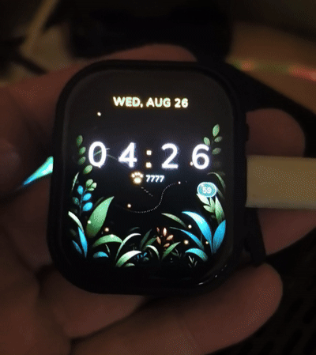

<p align="center">
  
</p>

<p align="center">
  <a href="README.md">English</a> · <b>Русский</b> · <a href="https://hleserg.github.io/Attadipa/">Страница проекта</a>
</p>

<h1 align="center">Atta-dipa</h1>

<p align="center">
<b>Independent by design.</b> Открытая платформа умных часов на ESP32-S3 для мест,<br>
где телефон сдаётся: LoRa-меш и офлайновая навигация — без трубки, без облачного<br>
аккаунта и без подписки где-либо в цепочке.
</p>

<p align="center">
  <a href="https://github.com/hleserg/Attadipa/actions/workflows/ci.yml"></a>
  <a href="https://github.com/hleserg/Attadipa/actions/workflows/codeql.yml"></a>
  
  
  <a href="LICENSE"></a>
  <a href="https://github.com/hleserg/Attadipa/discussions"></a>
</p>

<p align="center">
  <a href="#запустить-у-себя-на-столе-в-две-команды"><b>Запустить симулятор</b></a> ·
  <a href="#что-работает-сегодня"><b>Что работает сегодня</b></a> ·
  <a href="#чем-помочь"><b>Чем помочь</b></a> ·
  <a href="https://github.com/hleserg/Attadipa/discussions"><b>Открыть Discussion</b></a>
</p>

---

## Это настоящие часы, а не макет

<table>
<tr>
<td width="50%" align="center">
  
  <br>
  <sub><b>Часы на физическом устройстве.</b> Снято с живого фреймбуфера через
  собственный отладочный канал Atta-dipa, а не в дизайн-редакторе —
  <a href="docs/hardware/CLOCK_2026-08-26.md">стендовая запись</a>. Арт
  оригинальный; лапка и <code>7777</code> — заглушка вёрстки, а не шагомер.</sub>
</td>
<td width="50%" align="center">
  
  <br>
  <sub><b>Первая загрузка из флеша</b> на Waveshare ESP32-S3 Touch AMOLED 2.06.</sub>
</td>
</tr>
</table>

## Почему Atta-dipa

**Независимость.** Сообщения, навигация и время работают без приложения-компаньона,
без интернета и без аккаунта. Телефон — необязательный аксессуар, а не мозг часов.
Если у конкретных часов нет нужного железа, возможность приходит от **узла-компаньона**
по линку — и интерфейс говорит, в какой из двух ситуаций вы находитесь, потому что
*«у этих часов нет радио»* и *«ваш узел вне зоны»* — разные проблемы с разными
решениями.

**Меш по рождению.** Дальнобойные LoRa-сообщения на
[MeshCore](https://github.com/meshcore-dev/MeshCore) — с сохранением совместимости
с апстримом, а не форком в сторону.

**Часы говорят, когда не знают.** Это то, что большинство носимых устройств делает
неправильно, и именно ради этого проект и существует. Позиция несёт свой источник,
возраст и достоверность до самого пикселя. У навигационного экрана **девять**
состояний. Ровно одно означает *«вот твоё направление»*; остальные восемь называют
конкретную вещь, которую часы сказать не могут:

```
Готово                  ← единственное, которое является ответом

Ожидание GPS            Своя позиция устарела     Узел недоступен
Нет фиксации            Своя позиция неточна      Позиция узла неизвестна
Приёмник молчит         Позиция узла устарела
```

Плюс три оговорки, которые может нести даже удачный день — *«фиксация узла не
подтверждена, принято 4 мин назад»*, *«на этом устройстве нет приёмника»*,
*«не настроен источник позиции»* — и дистанция, которая признаёт свой потолок:
дальше 1000 км на экране `> 1000 км`, а не значение ограничителя под видом
измерения.

Никаких `0 м`. Никаких `(0, 0)`. Никакой стрелки, указывающей куда-то
правдоподобно. Если часы не могут сказать — они так и говорят, по-английски или
по-русски, и говорят, *чего именно* они не знают.

**Гибкость к железу — конструктивно.** Две платы часов, у которых почти нет
ничего общего, гоняют один и тот же бинарник. Приложения спрашивают, что
устройство умеет *делать* — `availability(Capability::Position)` — и никогда,
что на нём распаяно. Они даже не линкуются со слоем железа: спросить о чём-то
чип — это ошибка сборки, а не замечание на ревью.

**Честность о неизвестном — механическая.** Каждый факт о железе в этом
репозитории прослежен до даташита, схемы конкретной ревизии платы, исходников
вендора или стендового прогона — либо записан как `UNKNOWN` вместе с
экспериментом, который его закроет. Тест, не прогнанный на железе, никогда не
`PASS`, а `NOT EXECUTED — HARDWARE REQUIRED`. Формат цитат проверяет CI.

**Хакабельно.** ESP-IDF, C++17, LVGL, FreeRTOS. Настольный симулятор, гоняющий
обе геометрии экрана без единой платы. Инструмент, который снимает скриншоты и
управляет живым интерфейсом — и в симуляторе, *и* на физических часах по USB.

## Две топологии, и обе — продукт

Самое интересное в Atta-dipa: «часы» — это не всегда одно устройство.

```
  ЕДИНОЕ УСТРОЙСТВО                     РАЗНЕСЁННОЕ
  одно                                  два устройства

  T-Watch S3 Plus                       Waveshare AMOLED 2.06
  ├── дисплей 240×240, тач              ├── AMOLED 410×502, тач
  ├── GNSS  (u-blox MIA-M10Q) ✔         └── BLE ──┐   на этой плате нет
  ├── sub-GHz радио  (чип UNKNOWN)                │   ни радио, ни приёмника
  └── Atta-dipa                                   ▼
                                        Узел-компаньон
                                        ├── GNSS
      носитель и приёмник               └── LoRa / MeshCore
      на одном теле
                                            координата пересекает линк,
                                            и часы об этом говорят
```

Эта разница — не сноска: она меняет то, что часы вправе честно утверждать. На
едином устройстве приёмник у вас на теле, значит его фиксация — *ваша* позиция.
В разнесённой схеме координата узла — это координата *узла*, который может
лежать в кармане, а может на подоконнике, и часам не позволено втихую повысить
одно до другого —
[`NODE_POSITION_FROM_MESHCORE`](docs/research/NODE_POSITION_FROM_MESHCORE.md)
разбирает это правило, а [ADR-0013](docs/adr/0013-node-motion.md) объясняет,
почему свидетельство, снятое с одного тела, не вправе судить о железе на
другом.

Сегодняшний компаньон на стенде — серийный Heltec T114 с прошивкой MeshCore.
Специализированный **узел Atta-dipa** — LoRa, GNSS и ESP32 в одной коробке —
спроектирован, но не построен; [`docs/node/`](docs/node/NODE_PROFILE.md) — это
в основном честная запись того, что о нём до сих пор неизвестно.

## Что работает сегодня

Слова статуса здесь значат ровно то, что написано. `MEASURED` — снято с железа
или прибора; `IMPLEMENTED` — работает и покрыто тестами, но ещё не на плате;
`PLANNED` — проект без кода.

| | Состояние |
|---|---|
| **Загружается из флеша на настоящих часах** — AMOLED, ёмкостный тач, шины питания AXP2101, RTC PCF85063 и полный [цикл сна и пробуждения](docs/hardware/SLEEP_WAKE_2026-08-26.md) | ✅ `MEASURED` на Waveshare AMOLED 2.06 |
| **Часы, провижининг и меш-экран на устройстве**, по-английски и по-русски | ✅ `MEASURED` |
| **Разговаривает с MeshCore-узлом по BLE** — пейринг, соединение, пин узла по публичному ключу, показ пиров, SNR и последнего принятого по LoRa сообщения | ✅ `MEASURED` против Heltec T114 ([стендовая запись](docs/research/MESHCORE_T114_FIRST_CONTACT.md)) |
| **Отправить сообщение и увидеть ответ на запястье** | 🧪 `NOT OBSERVED` — следующий физический шов |
| **GNSS на T-Watch S3 Plus** — модуль назвал себя **u-blox MIA-M10Q**, и его NMEA доходит до сервиса позиции | ✅ `MEASURED` в помещении, без фиксации ([стендовый лог](docs/research/TWATCH_GNSS_LOCAL_BENCH_2026-09-06.md)) |
| **Фиксация под открытым небом на этом приёмнике** | 🧪 `NOT EXECUTED — HARDWARE REQUIRED` |
| **Навигация, которая отказывается выдумывать** — азимут, дистанция по большому кругу, устаревание и девять честных состояний выше | ✅ `IMPLEMENTED` и рисуется; дистанция до *удалённого* узла ещё ждёт [#450](https://github.com/hleserg/Attadipa/issues/450) |
| **Настольный симулятор**, обе геометрии, радио и наличие узла переключаются без пересборки | ✅ `IMPLEMENTED` |
| **Снимать и водить живой UI из другого процесса** — тапы, свайпы, кнопки, сценарные проходы | ✅ `MEASURED` и в симуляторе, *и* на физических часах по USB |
| **Дизайн-токены** — двенадцать цветовых ролей, день и ночь, с арифметикой контраста по WCAG и CI-проверкой, отклоняющей сырой hex в коде экранов | ✅ `IMPLEMENTED` |
| **Шрифты, которые не молчат об ошибке** — семь сабсетов Nunito Sans ровно на 177 кодпойнтов набора; неотрисовываемый символ роняет сборку | ✅ `IMPLEMENTED` |
| **Компас и курс** — API есть, стрелка поворачивается вместе с запястьем; магнитометра нет ни на одной плате, два модуля лежат на стенде и ждут врезки | 🧪 [`MAGNETOMETER_RETROFIT`](docs/research/MAGNETOMETER_RETROFIT.md) |
| **Тактильная отдача** — типизированные дескрипторы возможностей, драйвера пока нет | 📐 `PLANNED` |
| **Детский режим** — отдельный UX для шестилетки, а не взрослый интерфейс с крупным шрифтом | 📐 `PLANNED` |
| **Питание** — одно честное число: **413 мВт** на USB-входе Waveshare, простой на одном экране, аккумулятор отключён, 2026-09-05. Ни цифры сна, ни цифры с погашенным экраном, ни разбивки по шинам | 🔬 измеряется |
| **Sub-GHz радио T-Watch** — пять кандидатных чипов, и только часть из них вообще умеет LoRa. Маркировку с чипа никто не считал | ❓ `UNKNOWN` ([ADR-0003](docs/adr/0003-radio-not-lora.md)) |

Каждая строка ведёт к доказательству.
[`docs/research/VERIFIED_FACTS.md`](docs/research/VERIFIED_FACTS.md) — реестр, а
[`docs/research/OPEN_QUESTIONS.md`](docs/research/OPEN_QUESTIONS.md) — список
того, что пока никто не установил.

## Прямо сейчас

Живая работа на 2026-09-07 — [Issues](https://github.com/hleserg/Attadipa/issues)
и [pull requests](https://github.com/hleserg/Attadipa/pulls) показывают состояние
в реальном времени.

- **Позиция компаньона на запястье как направление** — вертикальный срез,
  превращающий координату узла в `NODE / 742 m / ↗ NE`
  ([#450](https://github.com/hleserg/Attadipa/issues/450)).
- **Собственный GNSS T-Watch под небом** — половина в помещении записана,
  фиксации нужно небо ([#442](https://github.com/hleserg/Attadipa/issues/442)).
- **Магнитометр внутри часов, которые с ним никогда не выпускались** — два
  модуля на стенде, до решения по разводке четыре замера тестером.
- **Забрать координату *удалённого* узла через MeshCore** — три кандидатных
  апстрим-пути, один из них за политикой на стороне узла.
- **Характеризация питания** — пока одно измеренное число простоя и ни одного
  числа для сна.

## Запустить у себя на столе, в две команды

Плата не нужна. Симулятор — это тот же самый UI, те же приложения и те же
дизайн-токены, только рисуют в окно, а не на панель.

```sh
sudo apt install libsdl2-dev          # или эквивалент вашей платформы
cmake -S . -B build-sim -DATTADIPA_BUILD_SIMULATOR=ON && cmake --build build-sim -j
./build-sim/sim/attadipa_sim --board waveshare-amoled-206
```

```
--board <id>      t-watch-s3-plus (240×240) | waveshare-amoled-206 (410×502)
--radio <chip>    подставить любой из пяти кандидатных радиочипов T-Watch
--node            представить спаренный, доступный узел-компаньон
--no-bring-up     не трогать ни одну часть — увидеть состояния недоступности
--screenshot <p>  записать экран в PNG
--frames <n>      отрисовать n кадров и выйти; с SDL_VIDEODRIVER=dummy — headless
```

Ни один из них не требует пересборки — в этом и смысл, и поэтому у проекта нет
отдельных бинарников под плату. Начните с `--no-bring-up`: это самый быстрый
способ увидеть, как на самом деле выглядит «часы говорят, когда не знают».

Дальше — управление из другого терминала:

```sh
python3 tools/watch_control.py info
python3 tools/watch_control.py tap --x 205 --y 250 --screenshot-after
```

Тот же инструмент говорит с физическими часами по USB. См.
[`docs/testing/WATCH_CONTROL.md`](docs/testing/WATCH_CONTROL.md).

## Чем помочь

Молодой проект с большой площадью и одним владельцем. Если что-то из этого —
ваше, здесь есть настоящая работа, а исследовательская дисциплина означает, что
гадать о поведении железа не придётся.

| Если вам интересно | Работа есть в |
|---|---|
| **Embedded / ESP-IDF** | бринг-ап плат, шины PMU, пути сна, периферия I2C, пробелы драйверов второй платы |
| **LoRa / MeshCore** | интеграция протокола, совместимость с апстримом, доставка сообщения *и ответа* |
| **GNSS / навигация** | NMEA и UBX, качество фиксации, устаревание, счисление пути, лестница честных состояний |
| **Датчики и курс** | врезка магнитометра, калибровка hard-iron и soft-iron, компенсация наклона |
| **UI / LVGL** | циферблаты, навигационный UX, движение, две очень разные геометрии экрана |
| **Хардварный хакинг** | стендовые измерения, антенны, питание, впайка датчика в часы, где его никогда не было |
| **Тестирование** | другие платы на ESP32-S3 и полевые тесты, а не стол в помещении |
| **Документация и исследование** | проследить утверждение до даташита, прочитать схему лист за листом, диффы апстрима |

**С чего начать.** [Discussions](https://github.com/hleserg/Attadipa/discussions) —
это парадная дверь, открытая всем: скажите, какая область вам интересна, или
предложите приложение для часов. Issues — инженерная очередь, она ограничена
коллабораторами; мейнтейнер переносит идею туда, когда её можно строить.

```
        Интересно?
             ↓
     Открыть Discussion  ←  сказать, чем хочется заняться
             ↓
   Мейнтейнер заводит issue с критериями приёмки
             ↓
        CONTRIBUTING.md  ←  соглашения по веткам, коммитам и PR
```

Прямо сейчас самый полезный вклад — **факт о железе с первоисточником**: схема,
страница даташита, отличие ревизии платы или измерение с реального устройства.
[`docs/research/OPEN_QUESTIONS.md`](docs/research/OPEN_QUESTIONS.md) — постоянный
список того, что стоит узнать, и если у вас есть любая из двух плат, один пункт
оттуда закрывается за выходные.

Перед первым pull request прочитайте [CONTRIBUTING.md](CONTRIBUTING.md).

## Целевое железо

| Плата | Роль | Радио / GNSS на борту |
|---|---|---|
| LilyGO T-Watch S3 Plus | единое устройство | GNSS **подтверждён** (MIA-M10Q); радиочип **UNKNOWN** |
| Waveshare ESP32-S3 Touch AMOLED 2.06 | разнесённая схема — носимая половина | **ни того, ни другого**, по замыслу |
| Узел-компаньон | отдельное устройство — LoRa, GNSS, ESP32 | даёт и то и другое, по линку |
| Настольный симулятор | полноправная цель разработки | симулируется, включая узел |

У платы Waveshare нет ни sub-GHz радио, ни GNSS-приёмника. Это не упущение
плана — это причина, по которой существует слой возможностей, и именно это не
даёт проекту стать прошивкой одной печатной платы.

Наличие — тоже не вся история. Тактильная отдача есть на обеих платах, и это
разная отдача: у одной драйверная микросхема с библиотекой форм сигнала, у
другой мотор на транзисторе. Возможность, которая просто «есть» или «нет», это
не выражает — поэтому здесь она типизированный дескриптор, а не булево. Что
именно несёт каждая плата — в
[`docs/research/HARDWARE_MATRIX.md`](docs/research/HARDWARE_MATRIX.md).

Обе платы обследованы покомпонентно, вплоть до карты выводов и шин питания.
T-Watch взят из вендорского документа на железо, вендорского заголовка платы и
**обеих опубликованных схем, прочитанных лист за листом**. Waveshare — из
вендорского README и его пакета поддержки платы; схема тоже прочитана,
извлечением текста, которое надёжно достаёт номера деталей и цепи и лишь иногда
— соседство выводов, поэтому строки, которым всё ещё нужен визуальный разбор
листов, так и помечены. Там, где схема и вендорский документ расходятся — а на
шинах питания T-Watch они расходятся, — расхождение записано как конфликт, а не
разрешено по предпочтению.

**Сборка под устройство сегодня целится в обе платы, и они не на одной стадии.**
Образ Waveshare — продуктовая прошивка: часы, провижининг, меш и навигация,
физический ввод, сон и пробуждение. Образ T-Watch — срез бринг-апа: панель, тач,
шины и GNSS-приёмник, пока без RTC, NVS, физического ввода и сна.

## Идеи в основе, о которых стоит знать

**Управление возможностями, в два слоя.** Приложения спрашивают, что устройство
умеет *делать*, и никогда — что на нём стоит. Они не узнают, какой GPIO питает
GNSS-модуль, на какой SPI сидит радио и есть ли GNSS-модуль вообще: узел-компаньон
поставляет его по линку, и ответ в обоих случаях одной формы. Инвентарь железа —
отдельный слой ниже границы сервисов, и он не линкуется в приложения, так что
спросить о чём-то чип — ошибка сборки, а не замечание на ревью. Различия плат
остаются внутри BSP; различия, которые плате не принадлежат, приходят через
реестр провайдеров, потому что ни один BSP не может знать на этапе сборки, что
подключат потом.

Возможности здесь ещё и не булевы, зафиксированные на старте: они могут
появляться и исчезать при открытом приложении, и каждое приложение обязано это
пережить. См. [ADR-0004](docs/adr/0004-capability-sources.md).

**Координация железа.** В часах подсистемы мешают друг другу *физически*:
вибромотор возмущает магнитометр, передача радио мешает захвату GNSS.
Центральный координатор выдаёт чувствительным измерениям тихие окна и
планирует некритичную активность вокруг них, чтобы ни одно приложение не должно
было знать, какие две подсистемы нельзя запускать одновременно.

Собственный пример спецификации — чтение компаса и вибрация, и стоит сказать
прямо: **именно эта пара не может произойти ни на одной целевой плате в
серийном виде** — магнитометра нет ни там, ни там. Настоящая первая задача
координатора здесь приземлённее и достовернее: пять устройств на одной шине
I2C, шины питания, кормящие сразу двоих, и три радио в одном антенном
окружении. Какие сочетания мешают на самом деле — вопрос измерения, он ведётся
в [`docs/hardware/INTERFERENCE_MATRIX.md`](docs/hardware/INTERFERENCE_MATRIX.md).

**Сначала переиспользовать, потом писать.** Зрелая открытая работа
предпочтительнее нового кода, а решение и его обоснование записываются в
[`docs/research/REUSE_LEDGER.md`](docs/research/REUSE_LEDGER.md).

Atta-dipa — не Linux-подобная ОС. Это единая встраиваемая платформа прошивки и
приложений поверх ESP32-S3 и ESP-IDF/FreeRTOS, рассчитанная поддерживать
несколько моделей часов из одной кодовой базы.

## Сборка

Хост-сборке не нужно ничего, кроме компилятора C++17 и CMake:

```sh
cmake -S . -B build && cmake --build build && ctest --test-dir build --output-on-failure
```

LVGL закреплён на v9.5.0 и вытягивается CMake по коммиту; сборка откажется
продолжать, если найденная версия не та, что была выбрана. Чтобы собрать офлайн
против уже имеющегося дерева, передайте
`-DATTADIPA_LVGL_SOURCE_DIR=/path/to/lvgl`.

### Сборка под устройство

Отделена от хост-сборки намеренно: корневой `CMakeLists.txt` хост-нативный,
чтобы симулятор и тесты продолжали работать на машине без тулчейна. Проект
ESP-IDF живёт в `firmware/` и закреплён на **ESP-IDF v5.5.5** — почему именно
эта версия, а не более новая, написано в
[`docs/research/DEPENDENCIES.md`](docs/research/DEPENDENCIES.md).

```sh
. $IDF_PATH/export.sh
cd firmware
idf.py set-target esp32s3
idf.py build
```

Есть второй вариант, который целиком исполняется из RAM и вообще ничего не
пишет во флеш, — предпочтительный маршрут для всего экспериментального.
[`docs/hardware/FIRMWARE_BRINGUP.md`](docs/hardware/FIRMWARE_BRINGUP.md) — это
процедура, включая то, как выглядит хорошая загрузка и что делать, когда она
не такая.

## Репозиторий

```
platform/                      инвентарь железа — чипы, выводы, шины, профили плат
core/                          сервисы и реестр возможностей, владеющий отображением
link/                          кадрирование транспорта, очередь кадров, автомат сессии
debug/                         отладочный канал разработки: скриншоты наружу, ввод внутрь
l10n/                          каталог строк и генерируемый из него код
ui/                            дизайн-токены: роли, отступы, контраст — без LVGL и без платы
ui/assets/                     исходный арт, сгенерированные маски LVGL и одна таблица
assets/fonts/                  сгенерированные сабсеты Nunito Sans с их провенансом
apps/                          приложения; линкуют core и не могут дотянуться до platform
sim/                           настольный симулятор и его конфигурация LVGL
firmware/                      проект ESP-IDF: сборка под устройство, конфиг и разделы
tests/                         хост-тесты, включая три, где фикстура обязана не собраться
tests/replay/                  детерминированный навигационный стенд и его записанные трассы
tools/                         сабсеттер шрифтов, конвейер изображений и проверки для CI
tools/watch_control.py         водить экран и снимать его — см. docs/testing/WATCH_CONTROL.md
tools/flash/                   проверка потолка раздела, загрузчик в RAM, бэкап флеша
tests/ui/scenarios/            проходы по интерфейсу как данные, а не как код
cmake/                         закреплённая зависимость LVGL

docs/master-prompt-final.md    спецификация продукта (источник истины)
docs/research/                 проверенные факты, решения владельца, открытые вопросы, зависимости
docs/node/                     узел-компаньон — в основном то, что о нём *не* известно
docs/hardware/                 матрица помех, заметки по платам, стендовые записи
docs/architecture/             архитектура, бюджет ресурсов
docs/adr/                      записи архитектурных решений
docs/testing/                  планы хост-тестов и тестов с железом в петле
docs/ui/                       дизайн-система и дизайн-референсы владельца
pics/                          брендовые материалы — баннер, иконка, фавикон
AGENTS.md                      короткое рабочее соглашение по всему репозиторию
docs/ROADMAP.md                долговременное направление продукта
```

То, что `apps/` не может дотянуться до `platform/`, обеспечивается линковкой, а
не ревью, и есть тест, который падает, если это убрать —
[ADR-0007](docs/adr/0007-two-capability-layers.md) §5.

Документы спецификации написаны по-русски; код, комментарии и остальная
документация — по-английски.

## Как этот проект делается

Стоит знать, если интересен процесс, а не продукт: работа приходит как GitHub
issue, агент открывает ветку и черновой pull request, а **второй, независимый
агент ревьюит его**, не написав его. Воркфлоу, их модель безопасности и
контроль расходов — в
[`docs/automation/`](docs/automation/CLAUDE_AUTOMATION.md).

Именно поэтому дисциплина доказательств выше — механическая, а не декларативная.
CI проверяет, что цитата несёт цитируемый текст, так что уехавший номер строки
становится красной сборкой, а не документом, который тихо врёт. Хост-набор
гоняется под GCC и Clang, под `-Werror` и под ASan+UBSan, а compile-fail тесты
стерегут границы заголовков железа, таблиц перевода и возможностей приёмника.

## Лицензия

Atta-dipa распространяется под GNU General Public License v3.0 или новее
(`GPL-3.0-or-later`) — см. [LICENSE](LICENSE). Проект остаётся открытым: вы
можете использовать, изучать, изменять и распространять его на этих условиях.
Распространяемые модификации и производные работы должны соответствовать GPL,
включая требования доступности исходного кода.

Принадлежность авторских прав и провенанс вкладов описаны в
[COPYRIGHT.md](COPYRIGHT.md); будущие вклады используют лёгкий
[Developer Certificate of Origin 1.1](DCO), без передачи прав и без CLA.

Сторонние компоненты сохраняют свои лицензии; каждый записан в
`docs/research/DEPENDENCIES.md` вместе с лицензией до того, как от него
что-либо начинает зависеть.

---

<p align="center">
  <sub><b>Atta-dipa</b> — от пали <i>attadīpa</i>, «имеющий себя островом или
  прибежищем». Светлячок Люмар несёт свой свет сам.</sub>
</p>
