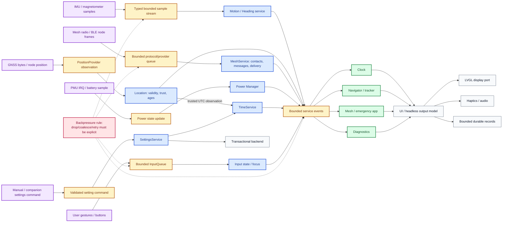
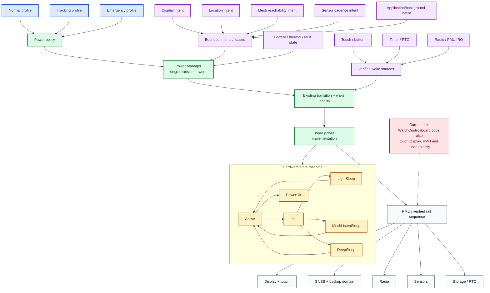
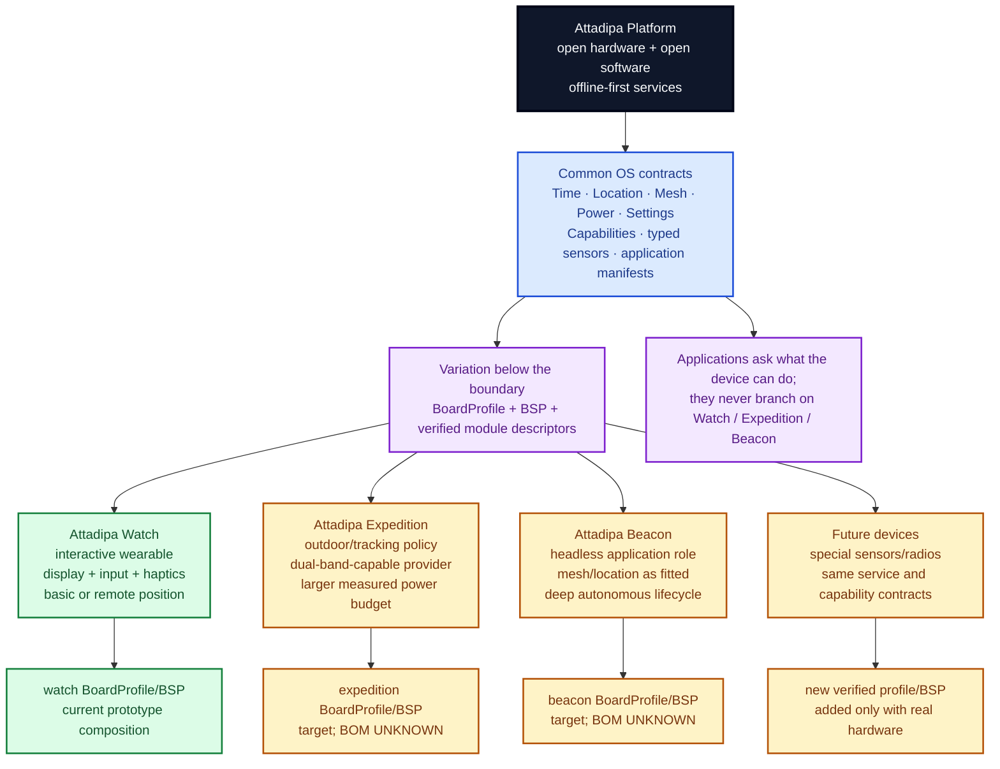
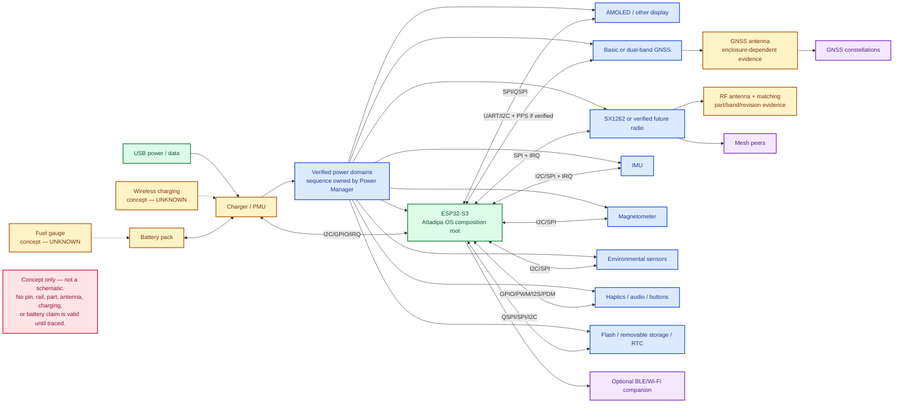

# Attadipa platform architecture audit

> Evidence snapshot and incremental migration guide. This document describes
> what exists, what is only a seam, and what should be built next; it is not a
> claim that the target architecture already ships.

| Field | Value |
| --- | --- |
| Audit date | 2026-08-27 |
| Code baseline | `8800055` on `origin/main` |
| Canonical task | [#289](https://github.com/hleserg/Attadipa/issues/289) |
| Concurrent work considered | [#264](https://github.com/hleserg/Attadipa/issues/264), [#281](https://github.com/hleserg/Attadipa/issues/281), draft [#282](https://github.com/hleserg/Attadipa/pull/282) |
| Hardware execution | **NOT EXECUTED — HARDWARE REQUIRED** |

The audit uses four evidence states:

- **Implemented** — a shipping or host-tested implementation is present on the
  baseline.
- **Partial** — a useful contract or model exists, but the shipping composition
  does not yet exercise the full seam.
- **Target** — a recommended next ownership boundary, not current behavior.
- **UNKNOWN** — repository evidence is insufficient; no hardware behavior is
  inferred.

## Executive verdict

Attadipa is not starting from a single-board architecture. Its host-built core,
platform inventory, capability model, source provenance, position/trust types,
power-state vocabulary, app manifests, and enforced dependency direction are
already platform-shaped. Those pieces should be preserved.

The shipping firmware composition is the single-board part. It selects
`waveshare-amoled-206` at build time and one file currently owns PMU, RTC/NVS,
display, touch, UI construction, and concrete pins. The immediate need is
therefore **runtime composition and resource ownership**, not a rewrite of the
core and not a directory reshuffle for its own sake.

The smallest credible path is:

1. wire the existing `BoardProfile`, `HardwareInventory`,
   `CapabilityRegistry`, and service states into the shipping composition;
2. make one owner arbitrate power transitions and rails;
3. add Location and sensor service seams together with their first real
   providers, reusing the existing domain types;
4. finish the in-flight Time (#264) and Mesh provider (draft #282) work rather
   than creating second abstractions;
5. extract a second BSP only when a second firmware board is being integrated.

This preserves working code while making every future board-specific decision
land below the OS/application boundary.

## 1. Current architecture audit

### Direct answers

| Question | Finding |
| --- | --- |
| What is already platform-ready? | The build layers, two-level capability model, availability/source semantics, normalized time/position/motion data, board descriptions, app manifests, bounded input queue, host tests, simulator geometries, and accepted transport/provider ADRs. |
| Where is hardware coupling concentrated? | Primarily in [`firmware/main/attadipa_main.cpp`](../../firmware/main/attadipa_main.cpp) and [`firmware/main/waveshare_board.cpp`](../../firmware/main/waveshare_board.cpp): board selection, pins, buses, AXP2101, PCF85063, CO5300/FT3168, NVS, UI, and sleep orchestration. |
| What will block multiple devices? | The shipping runtime does not instantiate the capability registry; no runtime power owner exists; Location and typed sensor services have no provider path; settings are used directly through NVS; app lifecycle and bounded cross-service delivery are not yet defined. |
| Where are new interfaces justified? | At provider/resource ownership seams with at least one real caller: Location provider, the Mesh providers proposed in draft #282, typed settings backend, and eventually a board power backend when the second BSP lands. A generic wrapper around every display, input, storage, or radio API is not justified. |
| What must be preserved? | `platform -> core -> apps`, board-neutral applications, `HardwareFeature` versus product `Capability`, `Availability` and provenance, `Timed<T>`, `TimeService`, `GnssObservation`/trust models, `InputQueue`, LVGL as the UI portability boundary, and the accepted ADRs listed below. |

### Enforced layers and real composition

The root [`CMakeLists.txt`](../../CMakeLists.txt) makes the useful architecture
executable rather than aspirational:

```text
platform  -> chip/module/board facts
   |
   v (PRIVATE)
core      -> services, policy, capabilities, domain values
   |
   +--> link/debug
   +--> apps (+ l10n)

apps do not link platform
core does not link localization
```

Boundary compilation tests protect those directions. Searches of `core/` and
`apps/` find no board-selection preprocessor branches. That is the most
important platform invariant and should not be traded for convenient
`#ifdef BOARD_X` calls.

The current firmware entry point is more concrete: it looks up one constant
profile and starts the Waveshare slice. The board file is roughly a vertical
prototype: it proves the physical display, touch, RTC, PMU, light sleep, and
Clock, but it is not yet the reusable device runtime.

The prototype proves nothing about Mesh, and this audit does not claim it does.
[`firmware/main/CMakeLists.txt`](../../firmware/main/CMakeLists.txt) builds only
`attadipa_main.cpp`, `waveshare_board.cpp`, `physical_input.cpp`, and the
optional `watch_control.cpp`; `app_main` logs the transport-independent `LinkState` phase
followed by `(no transport adapter)`; and no `MeshService` or `MeshProvider`
implementation exists anywhere on this baseline outside documentation. That code
lives on the branch of draft [#282](https://github.com/hleserg/Attadipa/pull/282)
and is read here as concurrent work, never as shipping evidence.

### Component assessment

| Area | Current evidence | Status | Keep / change |
| --- | --- | --- | --- |
| Build boundary | [`CMakeLists.txt`](../../CMakeLists.txt), boundary tests | Implemented | Keep exactly; strengthen through composition, not more layer names. |
| Hardware facts | [`BoardProfile`](../../platform/include/attadipa/platform/board_profile.h), [`board_profiles.cpp`](../../platform/src/board_profiles.cpp), [`HARDWARE_MATRIX.md`](../research/HARDWARE_MATRIX.md) | Implemented descriptions | Keep evidence-first profiles; add verified module/pin/rail data only as BSPs need it. |
| Physical features | [`HardwareFeature`](../../platform/include/attadipa/platform/hardware_feature.h), [`HardwareInventory`](../../platform/include/attadipa/platform/hardware_inventory.h) | Implemented model | Keep as the physical layer. |
| Product capabilities | [`Capability`](../../core/include/attadipa/core/capability.h), [`CapabilityRegistry`](../../core/include/attadipa/core/capability_registry.h) | Partial | Evolve the registry and wire it into firmware; do not add a competing Capability Manager. |
| Availability/provenance | [`availability.h`](../../core/include/attadipa/core/availability.h), ADR [0004](../adr/0004-capability-sources.md) and [0007](../adr/0007-two-capability-layers.md) | Implemented | Keep seven remedy-bearing states and provider provenance. |
| Time | [`TimeService`](../../core/include/attadipa/core/time_service.h), [`time_service.cpp`](../../core/src/time_service.cpp), ADR [0014](../adr/0014-time-source-and-synchronization.md) | Implemented, integration partial | Keep one service; finish #264 and extract RTC adapters only with a second backend. |
| Position/GNSS | [`position.h`](../../core/include/attadipa/core/position.h), [`trust.h`](../../core/include/attadipa/core/trust.h), ADR [0011](../adr/0011-gnss-integrity.md) | Rich model, no service/provider | Add a small Location owner with the first provider; no duplicate location types. |
| Motion/sensors | [`motion.h`](../../core/include/attadipa/core/motion.h), [`gnss_power.h`](../../core/include/attadipa/core/gnss_power.h) | Policy/types only | Add typed vertical slices with real sensors; avoid an untyped sensor bag. |
| Power | [`power_state.h`](../../core/include/attadipa/core/power_state.h), [`physical_input.cpp`](../../firmware/main/physical_input.cpp) | State policy implemented, runtime owner missing | Preserve states; centralize current orchestration, then add a board backend with the second BSP. |
| Input | [`input.h`](../../core/include/attadipa/core/input.h), firmware polling in `PhysicalInput` | Implemented bounded seam, integration concrete | Keep `InputQueue`; factor producers only when another board/input path exists. |
| Display/UI | [`display_info.h`](../../platform/include/attadipa/platform/display_info.h), [`ui/`](../../ui/), simulator | Geometry portable, firmware backend concrete | Keep LVGL as the application-facing seam; do not wrap it in an empty Display Service. |
| Storage/settings | Persistent capability and ADR [0006](../adr/0006-settings-and-bounded-values.md); direct NVS use in board code | Target only | Implement typed SettingsService for a real migration; wait for a second storage consumer before a universal StorageService. |
| Mesh/radio | ADR [0003](../adr/0003-radio-not-lora.md), [0008](../adr/0008-mesh-service-providers.md), [`radio_info.h`](../../platform/include/attadipa/platform/radio_info.h); no `MeshService`/`MeshProvider` code on the baseline | Target; the provider/service slice is in flight in draft #282 and is not merged | Complete one `MeshService`; keep raw radio below the local provider. |
| Applications | [`AppManifest`](../../apps/include/attadipa/apps/app_manifest.h), Clock | Manifest implemented; lifecycle partial | Add lifecycle/navigation only with the second real app. |
| Events/concurrency | `CapabilityChanged` type, `InputQueue`, subsystem-specific queues | Partial | Define bounded delivery and ownership before several services get independent tasks; do not add a generic bus pre-emptively. |

### Coupling that is acceptable today

Not every concrete call is architectural debt. The following can remain until a
second consumer exists:

- LVGL is already the portable display/widget contract; a second display
  interface would add ceremony without portability.
- `InputQueue` already normalizes physical and remote input; an `InputService`
  class with no extra ownership would only rename it.
- a concrete Waveshare BSP is appropriate for the only shipping board. The
  defect is that the composition root cannot select another BSP, not that the
  driver names its chips.
- one settings backend and one power backend may start concrete. Interfaces are
  warranted when the second backend arrives or when ownership must be tested
  independently.

## 2. Target Attadipa OS service model

The requested service names are useful responsibilities, but they should map to
existing seams rather than force one class per box.

| Requested responsibility | Current state | Minimal target |
| --- | --- | --- |
| Time Service | Real `TimeService`; Waveshare RTC/NVS adapter is embedded in board code | Keep the service as sole wall-clock owner; feed `TimeObservation` from RTC, GNSS, optional phone, manual entry, and later network/mesh providers. |
| Location Service | Normalized observation, validity, trust, motion and power policy exist; no owner/provider | Add one owner when the first local or node provider is integrated. Applications consume normalized state only. |
| Sensor Service | Motion evidence/types, no shipping sensor driver/service | Prefer typed `MotionService` and later typed environmental streams. Add a facade only if several apps need discovery across sensor families. |
| Radio Service | Radio facts and the ADR-0008 provider design; the `MeshService` node path exists only on the branch of draft #282 | Applications use protocol services (`MeshService`), not a raw radio API. A local provider may privately own a `RadioBackend`. |
| Power Manager | State vocabulary and transition legality; concrete control in WatchControl/board file | One runtime owner accepts bounded intents, applies a product power profile, and alone executes device transitions/rails. |
| Storage Service | Persistent/removable capabilities; direct NVS metadata | First implement ADR-0006 `SettingsService`; introduce a broader storage owner only with a second durable data consumer. |
| Display Service | `DisplayInfo`, LVGL, simulator geometries; board-specific panel init | Treat LVGL plus a BSP display port as the seam. A service is needed only if power/lifecycle arbitration adds behavior beyond LVGL. |
| Input Service | `InputQueue`/`InputState`, physical and remote input model | Keep it; compose board producers into the queue. Add a named service only when it owns focus, gestures, or routing. |
| Capability Manager | Registry and two capability layers exist, but shipping firmware bypasses them | Evolve and wire `CapabilityRegistry`; add bounded provider lifecycle/events instead of a second manager. |
| Application Layer | Manifests and Clock exist | Introduce a small lifecycle/navigation owner when a second real app requires activation, suspension, and capability-change delivery. |

The target is an ownership graph, not a collection of pass-through objects.

## 3. Time Service and RTC

### Current source of truth

`TimeService` is the correct logical source of truth. It separates UTC from
local presentation, records source, quality, observation time, and freshness,
prioritizes sources, and guards large corrections. Clock consumes formatted
state rather than a PCF register.

The Waveshare composition currently acts as its adapter:

- PCF85063 is read into a provisional observation at startup;
- accepted time is written to the physical RTC;
- timezone and time metadata use ESP-IDF NVS directly;
- manual/transport synchronization is converted to the service vocabulary;
- the service object and all adapter state live in `waveshare_board.cpp`.

That is a working vertical slice, but it couples the adapter, persistence, and
board composition.

### Sleep and reset behavior

| Event | Current behavior | Audit finding |
| --- | --- | --- |
| Light sleep | Implemented in WatchControl; RAM `TimeService` state survives | Suitable for the present slice. |
| Deep sleep | State and reset-reason vocabulary exist; no shipping deep-sleep transition was found | **Partial**; do not claim retained trusted time. |
| Restart / deep-sleep boot | A new service reads the external RTC as provisional and restores timezone metadata from NVS | Wall time can return, but trust/freshness intentionally starts over. |
| Trusted-source freshness | Not persisted as proof across reboot | Correct conservative behavior. |
| Last accepted UTC metadata | Written, but no baseline path was found that restores it into service state | Do not treat it as a recovery guarantee. |
| ESP32 internal RTC as durable wall clock | Not established by current implementation or retained-time bench evidence | **UNKNOWN**; do not add it as a promised backend yet. |

The current boards use different external RTC parts (PCF85063 on the Waveshare
profile and PCF8563 on the T-Watch profile). That makes a small `RtcBackend`
contract reasonable **when the second board integration starts**. It does not
justify two Time Services.

### Synchronization providers

All providers should emit the existing observation vocabulary:

```text
PCF85063 / future PCF8563 --+
GNSS receiver --------------+--> TimeObservation --> TimeService --> Clock/apps
manual setup ---------------+
optional BLE phone ---------+
```

The provider supplies UTC, source, quality, and monotonic observation time.
`TimeService` keeps selection and correction policy. Applications therefore do
not change when GNSS, a phone, or another RTC is added.

Issue [#264](https://github.com/hleserg/Attadipa/issues/264) remains the
canonical place for two known correctness gaps: freshness-aware selection
between candidates and recoverable consistency when RTC and NVS writes do not
both succeed. This audit must not create a second time abstraction or duplicate
that issue.

## 4. Location Service and GNSS

### Existing foundation

The existing `GnssObservation`/position model already covers the requested
application data and more:

| Application field | Existing normalized field/policy |
| --- | --- |
| Latitude / longitude | Fixed-point geodetic position |
| Altitude | MSL and ellipsoid altitude |
| Accuracy | Horizontal and vertical accuracy |
| Speed | Ground speed |
| Heading | Course over ground with explicit frame/provenance |
| Satellites | Used and visible counts, plus signal information |
| Timestamp | Receiver time plus monotonic observation/arrival ages |
| Fix status | Fix type, validity, and trust/integrity result |

It also represents dilution of precision, C/N0, jamming/spoofing/protection
signals, source/native metadata, and separate value/source ages. ADR-0011 makes
validity and integrity explicit. These types should be reused unchanged unless
a real provider proves a missing field.

### Missing ownership seam

No baseline `LocationService`, local GNSS driver, or provider registry is wired.
Adding a module directly to an app would therefore bypass the strongest part of
the current design.

The minimum useful target is:

```text
Navigator / Track / Time sync
              |
       LocationService
              |
       PositionProvider
          /       \
 LocalGnssProvider NodePositionProvider
        |                 |
 module driver       node/link client
        |
 verified UART/I2C + power control through the BSP/power owner
```

One provider contract is enough. A separate “GNSS HAL” and “GNSS Provider” that
only forward the same calls would be duplication. The module driver owns
protocol bytes and receiver configuration; the provider translates those bytes
into `GnssObservation`; the service owns effective source, availability,
validity, trust, and age.

Basic and dual-band receivers remain interchangeable above the provider. Their
precision/integrity differences appear in observations and a typed provider
descriptor, not in application branches such as `if expedition`.

## 5. Capability Manager

Attadipa already has two deliberately different layers:

1. `platform::HardwareFeature` answers what physical facilities are fitted.
2. `core::Capability` answers what product behavior the device can provide.

Collapsing them into a flat list such as `AMOLED`, `LORA_RADIO`, and
`GNSS_HIGH_PRECISION` would undo ADR-0007 and teach applications about parts.
The requested vocabulary maps cleanly without a new manager:

| Requested item | Correct home |
| --- | --- |
| DISPLAY / AMOLED | `HardwareFeature::Display` plus `DisplayInfo::technology`; UI applications should not require AMOLED. |
| LORA_RADIO | `HardwareFeature::Radio` plus `RadioInfo` modulation/band/protocol support; ADR-0003 explicitly prevents equating a radio with LoRa. |
| GNSS_BASIC / GNSS_HIGH_PRECISION | Fitted receiver/provider descriptor and observation accuracy/integrity; product capability remains `Position`/`Heading`. |
| IMU / MAGNETOMETER | Physical axes/features; typed Motion/Heading services expose behavior. |
| VIBRATION | Physical haptic actuator maps to product `Haptics`. |
| BATTERY_GAUGE / WIRELESS_CHARGING | Hardware descriptors and power diagnostics. Add a product capability only if an application behavior genuinely depends on it. |

`Availability` and `CapabilitySource` already distinguish unsupported,
unprovisioned, off, unreachable, incompatible, failed, and ready, with local or
node provenance. `supports()` is deliberately stable while availability may
change. That is more useful than a Boolean feature set.

The current registry is still an interim composition: one `NodeLink`, one
companion state, a fixed mask of node-providable capabilities, and local-first
selection. It is mainly exercised in host/simulator code; the shipping firmware
does not instantiate it. `CapabilityChanged` exists but has no delivery path.

Evolution should be incremental:

1. wire the existing registry into firmware and feed it real hardware/provider
   state;
2. enforce legal availability transitions at update boundaries;
3. replace the one-node stub with bounded provider records only when the second
   real provider requires selection;
4. publish change events through the chosen bounded service-delivery mechanism.

## 6. Power architecture

### What exists

`PowerState` already names `Active`, `Idle`, `LightSleep`, `MeshListenSleep`,
`DeepSleep`, and `PowerOff`; transition and wake legality are host-tested. GNSS
power policy distinguishes cold/warm/hot start evidence and avoids promising
retention when backup power is unknown.

The shipping path implements a useful light-sleep slice, but ownership is
split: WatchControl and board code directly control display state, brightness,
PMU behavior, and sleep entry. PMU rail initialization is board-specific and
there is no service that arbitrates GNSS, radio, display, sensor, or application
requests.

### Product profiles are not hardware states

The requested modes should be orthogonal policy profiles:

| Policy profile | Intent | Example consequences, subject to measured budgets |
| --- | --- | --- |
| Normal | Balanced interactive use | Display/input responsive; periodic providers as requested. |
| Tracking | Prefer continuous track quality | GNSS/sensors receive longer leases; display may still sleep. |
| Emergency | Prefer reachability and essential sensing over UI | Mesh/GNSS policy escalates; non-essential consumers are denied or reduced. |

Those policies choose among the existing hardware states; they must not replace
the state machine. “Emergency” can remain active, listen-sleep, or deep-sleep
depending on board capability and evidence.

### Minimal ownership model

Consumers request an intent or bounded resource lease. One Power Manager
decides whether it is permitted, selects policy, sequences the transition, and
updates availability. Only the board power implementation touches PMU/GPIO
rails. The first version may be concrete around the current board; introduce an
abstract backend when the second BSP makes the variation real.

Rail ordering, shared consumers, and PMU interrupt ownership are hardware facts.
The repository still records the relevant cross-rail ownership decision as
open; until a schematic/BSP/bench establishes it, details are **UNKNOWN** and
belong in an ADR/evidence report before production code depends on them.

## 7. Sensor architecture

The platform inventory already distinguishes accelerometer, gyroscope, and
magnetometer facilities. Core owns motion evidence and heading-frame rules.
Neither profile currently has a shipping sensor driver or service wired into
applications; QMI8658/BMA423 names in profiles are evidence, not implementations.

Do not start with a generic `SensorValue { id, float[] }` bus. It discards units,
frames, calibration, sampling age, and integrity precisely where wearable data
needs them. Start with the first real vertical slice:

```text
board IMU driver -> typed MotionObservation -> MotionService -> app/power policy
```

Later environmental families can use their own typed observations. A discovery
facade called Sensor Service becomes useful only when several applications need
to enumerate several typed streams. Magnetometer calibration and body/track
heading frames must continue to follow ADR-0009; a node's body heading is not
the watch's heading.

## 8. Radio and MeshCore

The accepted architecture is already protocol-first:

- ADR-0003 separates radio chip, modulation, band, and protocol support.
- ADR-0008 gives applications one `MeshService` and hides local/node provider
  selection.
- draft PR #282 proposes a bounded, transport-independent MeshCore Companion
  client behind `MeshProvider`, with executable simulated protocol frames. It is
  unmerged: its `core/mesh_service.*` and `link/meshcore_companion.*` files exist
  only on its own branch, the shipping composition does not construct them even
  there, and its NimBLE runtime and physical validation remain in progress.

The rest of this section therefore describes the target seam, not behavior the
baseline has.

Applications should continue to call `MeshService`, not `SX1262`, LoRa, BLE, or
UART. A public generic Radio Service would either expose radio-specific details
or become a least-common-denominator wrapper. If a local-radio MeshCore spike
proves the need, add a private radio backend owned by `LocalMeshProvider`:

```text
Messenger / Emergency app
          |
      MeshService
       /       \
NodeMeshProvider  LocalMeshProvider
       |                 |
 BLE companion      private RadioBackend
                          |
                   SX1262 / proven future part
```

Provider arbitration, compatibility, failover, queueing, and identity belong
to MeshService/provider policy. Chip register access, IRQs, airtime, and RF
power belong below the local provider and Power Manager. Complete #282 before
generalizing this seam.

## 9. Hardware profiles and BSP composition

Two evidence-backed `BoardProfile` records already exist:

- `t-watch-s3-plus`;
- `waveshare-amoled-206`.

They describe feature masks, display geometry/technology, radio information,
and buttons. They deliberately preserve unknown/conflicting facts instead of
inventing defaults. `ProfileInventory` turns them into runtime hardware state.

What they do not yet describe is also important: full pin maps, buses, PMU rail
dependencies, concrete driver factories, module variants, calibration, and
antenna/enclosure effects. Those currently live in the Waveshare composition or
remain research facts.

When the second firmware board starts—not before—use a structure equivalent to:

```text
boards/
  attadipa_watch_v1/       verified pins, buses, rails, drivers, composition
  attadipa_devkit_v1/      verified pins, buses, rails, drivers, composition
  attadipa_expedition_v1/  verified pins, buses, rails, drivers, composition
```

The exact directory name is less important than the contract:

- `firmware/main` selects a board composition without embedding module logic;
- each BSP owns only verified pins, buses, rails, part descriptors, and driver
  construction;
- core and apps depend on services/capabilities, never profile IDs;
- receiver/radio/display variants are typed module descriptors or build-time
  composition, not copied board profiles for every SKU permutation;
- no board-specific preprocessor branch enters `core/` or `apps/`.

Headless Beacon builds should compose the same core without a display stack.
Before that firmware exists, define an interactive/headless application role;
do not add a fake display capability merely to hide Clock.

## 10. ADR assessment

### Preserve

| ADR | Finding |
| --- | --- |
| [0002 — Companion is optional](../adr/0002-companion-is-optional.md) | Required for autonomous devices; preserve. |
| [0003 — Radio is not LoRa](../adr/0003-radio-not-lora.md) | Essential for future radio variants; preserve. |
| [0004 — Capability sources](../adr/0004-capability-sources.md) | Correct provenance/remedy model; preserve. |
| [0006 — Settings and bounded values](../adr/0006-settings-and-bounded-values.md) | Good target; implement incrementally rather than replacing it. |
| [0007 — Two capability layers](../adr/0007-two-capability-layers.md) | Central platform rule; preserve and wire into firmware. |
| [0008 — Mesh service providers](../adr/0008-mesh-service-providers.md) | Correct app/protocol/provider split; complete #282. |
| [0009 — Heading](../adr/0009-heading.md) | Prevents invalid body/track frame fusion; preserve. |
| [0011 — GNSS integrity](../adr/0011-gnss-integrity.md) | Already supports basic and high-integrity receivers; preserve. |
| [0013 — Node motion](../adr/0013-node-motion.md) | Keeps remote motion provenance honest; preserve. |
| [0014 — Time source and synchronization](../adr/0014-time-source-and-synchronization.md) | Correct single-owner model; finish implementation defects in #264. |

ADR-0001 is superseded by the two-layer model. ADR-0005 remains provisional
until measured encoding and endpoint/multiplexing work closes its open choices.
Localization ADR-0010 is orthogonal and consistent with the dependency graph.

### Decisions still needed

Create an ADR only when its decision becomes necessary:

1. **Power and PMU ownership** — policy profiles versus hardware states, rail
   owner, request/lease semantics, and rollback on partial transition. This is
   needed before several consumers can independently power hardware.
2. **Runtime composition/BSP contract** — when the second firmware board begins,
   define profile selection, construction, and ownership without a DI framework.
3. **Bounded event/concurrency delivery** — before several services acquire
   independent tasks, decide queue ownership, backpressure, ordering, and
   shutdown behavior.
4. **Local MeshCore radio mechanism** — only after a measured spike shows what
   the pinned upstream and chosen radio require; update/extend ADR-0008 rather
   than deciding from an idealized diagram.

No ADR is needed merely to create pass-through Display, Input, Sensor, Radio,
or Storage classes.

## 11. Future hardware readiness

This is an OS-readiness assessment, not a carrier-board design.

| Hardware area | Ready above the driver? | Missing seam / evidence |
| --- | --- | --- |
| ESP32-S3 | Mostly: host core is SDK-neutral; current BSP uses ESP-IDF | Second BSP composition and resource measurements. |
| SX1262 / future radio | Radio descriptors and Mesh provider ADR are ready | Local provider/driver, verified part/band/antenna, IRQ and power ownership. |
| Basic / dual-band GNSS | Observation, accuracy, integrity, trust, and power policy are ready | Location owner, provider/driver, verified interfaces and retention behavior. |
| Magnetometer | Feature, heading frames, and ADR are ready | Fitted part is absent on current profiles; driver, calibration storage, and enclosure validation are missing. |
| IMU | Feature axes and motion types exist | Real QMI8658/BMA423 driver/service integration, axes/calibration evidence. |
| AMOLED / other display | Geometry, DPI, technology and simulator support exist | BSP display ports and measured power/lifecycle behavior for each panel. |
| Battery / PMU | Inventory, diagnostics, power states, and AXP2101 slice exist | One runtime owner, verified rail graph, charging/fault policy, measured budgets. |
| Fuel gauge | Not modeled as a concrete fitted part | **UNKNOWN** until a schematic/part exists; then add a descriptor/driver below Power Manager. |
| Wireless charging | No verified fitted implementation | **UNKNOWN**; treat as a charging input/backend, not an application capability. |
| Enclosure / antenna variants | Provenance model can carry resulting quality | Verified antenna, axis, thermal, RF, and calibration properties must enter the BSP/evidence, never case-name branches in apps. |

## 12. Priority plan and issue-ready tasks

These are candidate scopes, not a second task ledger. Open one finite GitHub
issue per accepted item; existing issue #264 and PR #282 remain canonical.

### P0 — architecture-critical

#### P0.1 — Wire existing capability and service state into the shipping composition

- **Problem:** firmware selects a concrete Waveshare slice but does not
  instantiate `HardwareInventory`/`CapabilityRegistry`; runtime capability
  answers and provider state therefore do not govern the shipping UI.
- **Minimal solution:** create the inventory from the selected existing profile
  in the composition root, instantiate the existing registry, and update it
  from real board/provider lifecycle state. Make Clock consume those answers, and
  any Mesh diagnostics that arrive with #282. Do not add a container or
  dependency-injection framework.
- **Likely files:** `firmware/main/attadipa_main.cpp`,
  `firmware/main/waveshare_board.cpp`, `core/src/capability_registry.cpp`,
  `platform/src/profile_inventory.cpp`, shipping-seam and boundary tests.
- **Risk:** medium; incorrect state mapping can hide a working feature or offer
  an impossible remedy.
- **Platform value:** makes one OS image reason about fitted and remote
  facilities without applications naming the board.

#### P0.2 — Decide power ownership and centralize the first runtime owner

- **Problem:** display, PMU, light-sleep, and future GNSS/radio consumers can
  control hardware from separate paths; no component owns transition rollback
  or competing requests.
- **Minimal solution:** first write the power/PMU ownership ADR. Then centralize
  existing transition calls in one concrete runtime owner, with bounded
  consumer intents and the existing `PowerState` legality. Keep the current
  board implementation concrete; add a backend interface when the second BSP
  demonstrates variation.
- **Likely files:** new ADR, `core/include/attadipa/core/power_state.h`,
  `core/src/power_state.cpp`, `firmware/main/physical_input.*`,
  `firmware/main/waveshare_board.cpp`, host tests.
- **Risk:** high; wrong rail order or rollback can corrupt state or strand the
  device. Unverified rail dependencies remain `UNKNOWN`.
- **Platform value:** enables tracking/emergency policies and multiple boards
  without allowing each driver to power itself.

#### P0.3 — Add Location ownership with the first real provider

- **Problem, and it is answered:** the rich GNSS domain types had no producer,
  so the first module wanting a coordinate would have had to wire one into an
  application. The owner exists now — `core/include/attadipa/core/location_service.h:101`
  — "class PositionProvider {" is the one contract and
  `core/include/attadipa/core/location_service.h:150` — "class LocationService {"
  is the owner above it, publishing availability, validity, trust, provenance
  and both ages. There is no second forwarding HAL and applications name no
  provider.
- **The first provider, and what it is allowed to claim:**
  `link/include/attadipa/link/node_position_provider.h:22` —
  "class NodePositionProvider final : public core::PositionProvider {" reads the
  coordinate a MeshCore node states in its own advertisement. It lives in
  `link/` because it knows a wire format. It states
  `link/src/node_position_provider.cpp:38` —
  "out.observation.fix_type = core::FixType::Unknown;" and therefore no path
  through it reaches `PositionValidity::Valid`: the node holds the fix flag, the
  satellite count and the receiver's UTC and transmits none of them, and its own
  `isValid()` gates the write rather than the send, so a receiver that stops
  solving leaves the last coordinate on the wire unchanged
  (`docs/research/NODE_POSITION_FROM_MESHCORE.md:204` — "keeps being transmitted").
  The age only
  the node could have stated has no answer at all —
  `core/src/location_service.cpp:156` — "report; returning `Millis{0}` would be the false measurement" — rather than a
  zero that would read as a measurement.
- **What is still open, deliberately:** the LPP decoder, local GNSS, any
  estimator or fusion, GNSS power policy, provider selection between two live
  providers, and the ADR-0011 amendment that would give `classify()` a case for
  a coordinate whose fix type was never stated. Until that amendment lands,
  every node observation is `NoFix`, and the host tests assert exactly that so
  it cannot land silently.
- **Platform value:** basic, dual-band, and node-provided location become
  interchangeable to applications.

#### P0.4 — Close the remaining TimeService correctness work in #264

- **Problem:** known freshness selection and RTC/NVS partial-write consistency
  findings remain under the existing time issue.
- **Minimal solution:** complete and verify #264 in the existing `TimeService`
  and Waveshare adapter; do not create another issue or service. Preserve
  conservative reboot trust semantics.
- **Likely files:** `core/src/time_service.cpp`,
  `firmware/main/waveshare_board.cpp`, time host/firmware seam tests.
- **Risk:** high; stale or split-brain time damages logs, tracks, Mesh behavior,
  and autonomous recovery.
- **Platform value:** every future synchronization provider inherits one
  reliable correction policy.

### P1 — valuable before the next device family

#### P1.1 — Complete Mesh provider arbitration after #282

- **Problem:** the node provider slice is in flight in draft #282 and absent
  from the baseline; local versus node selection/failover is therefore not
  exercised by the shipping runtime, or by anything else.
- **Minimal solution:** finish #282, then add only the arbitration needed by a
  measured second provider. Keep `MeshService` as the sole app API and raw radio
  control private to the local provider.
- **Likely files:** the files introduced by #282, capability registry,
  composition root, protocol/provider tests, ADR-0008 if policy changes.
- **Risk:** medium-high; duplicate messages, queue loss, or identity ambiguity.
- **Platform value:** the same application can use companion and future local
  radios.

#### P1.2 — Implement typed SettingsService and migrate one real consumer

- **Problem:** ADR-0006 exists but RTC/time metadata uses NVS directly in board
  code, coupling settings to one SDK and composition.
- **Minimal solution:** implement the bounded typed settings contract with one
  ESP-IDF backend and migrate time metadata transactionally. Do not build a
  virtual filesystem or arbitrary key/value public API.
- **Likely files:** new core settings contract, firmware NVS backend,
  `firmware/main/waveshare_board.cpp`, ADR-0006 tests.
- **Risk:** medium-high; migration/partial writes can lose user state.
- **Platform value:** board and storage backends can change without changing
  services or apps.

#### P1.3 — Ship the first typed motion-sensor vertical slice

- **Problem:** current boards declare accelerometer/gyroscope facilities but no
  driver/service feeds motion policy or applications.
- **Minimal solution:** choose the first physically available board, verify the
  part and axes, implement its driver below a typed Motion observation/service,
  add calibration knobs and one end-to-end shipping-seam test.
- **Likely files:** board driver/BSP, `core/include/attadipa/core/motion.h`, a
  small motion service, capability registry, tests, evidence report.
- **Risk:** high; axes, units, bias, cadence, and wake interrupts are physical.
- **Platform value:** later IMUs vary below one typed behavior contract.

#### P1.4 — Define bounded event and application lifecycle delivery

- **Problem:** `CapabilityChanged` has no consumer path; `InputQueue` and the
  bounded provider queue proposed by draft #282 are separate designs that have
  never met; a second app will need activation/suspension and service updates
  without polling every subsystem.
- **Minimal solution:** when the second real app lands, define one bounded
  delivery rule (ownership, capacity, backpressure, ordering, shutdown) and a
  minimal manifest-driven lifecycle. Reuse existing queues where possible.
- **Likely files:** `apps/app_manifest.*`, core capability events, composition
  root, one integration test, concurrency ADR.
- **Risk:** medium; unbounded or blocking delivery can stall the device.
- **Platform value:** interactive and headless applications share predictable
  service updates.

#### P1.5 — Extract the BSP/profile contract with the second firmware board

- **Problem:** verified descriptive profiles exist, but pins/drivers and
  construction are embedded in the Waveshare composition.
- **Minimal solution:** while integrating the second board, move each board's
  verified composition under a BSP/profile-owned location and make main select
  it at build time. Move only code shared by both boards.
- **Likely files:** `platform/`, `firmware/main/`, new `boards/<profile>/`
  directories (name decided in the ADR), build configuration, boundary tests.
- **Risk:** medium; premature extraction may hide necessary board differences.
- **Platform value:** Watch, Expedition, and future carriers share OS/services
  without board branches in core/apps.

### P2 — defer until evidence or a product slice requires it

#### P2.1 — Define a headless device/application role before Beacon firmware

- **Problem:** current application assumptions are display-centric, but no
  Beacon firmware exists to prove the required lifecycle.
- **Minimal solution:** with the first Beacon slice, define headless manifests,
  boot policy, diagnostics, and update/recovery entry points; omit UI rather
  than emulate a display.
- **Likely files:** app manifests, composition/build configuration, Beacon BSP,
  lifecycle tests.
- **Risk:** medium.
- **Platform value:** supports beacons and infrastructure nodes on the same OS.

#### P2.2 — Extract RTC backends with the second RTC implementation

- **Problem:** the current PCF85063 adapter is embedded; T-Watch evidence names
  PCF8563, but that shipping integration does not yet exist.
- **Minimal solution:** when integrating it, extract the smallest read/write
  backend consumed by the existing TimeService adapter. Consider an ESP system
  clock backend only after reset/retention/drift evidence.
- **Likely files:** firmware/BSP RTC modules, TimeService adapter tests, hardware
  evidence.
- **Risk:** medium-high.
- **Platform value:** clocks change without changing applications or selection
  policy.

#### P2.3 — Add fuel-gauge, charging, and radio-coexistence descriptors only with hardware

- **Problem:** future carrier concepts mention parts and conflicts that are not
  selected or measured.
- **Minimal solution:** once a schematic/revision exists, record verified
  descriptors and extend the existing Power/Radio owners only for real shared
  resources. Do not create empty APIs now.
- **Likely files:** board profile/BSP, verified-facts research, Power/Radio
  policy and focused tests.
- **Risk:** high because these are electrical/RF facts.
- **Platform value:** future carriers extend the same ownership model without
  speculative code today.

## 13. Visual architecture documentation

The four evidence states above govern these diagrams too. Only a box the diagram
marks as implemented refers to merged code on the baseline; §13.2 and §13.3 draw
the target ownership graphs in full, so most of their boxes are recommendations
rather than existing code paths. Work that is only in an open pull request is
labelled with its number and drawn as target.

### 13.1 Main Attadipa platform map

```mermaid
flowchart TB
  classDef implemented fill:#DCFCE7,stroke:#15803D,color:#14532D,stroke-width:2px
  classDef partial fill:#FEF3C7,stroke:#B45309,color:#78350F,stroke-width:2px
  classDef target fill:#DBEAFE,stroke:#1D4ED8,color:#1E3A8A,stroke-width:2px
  classDef risk fill:#FFE4E6,stroke:#BE123C,color:#881337,stroke-width:2px
  classDef external fill:#F3E8FF,stroke:#7E22CE,color:#581C87,stroke-width:2px
  classDef neutral fill:#F8FAFC,stroke:#475569,color:#0F172A

  subgraph APPS["Application layer — board-neutral"]
    direction LR
    CLOCK["Clock<br/>implemented"]
    MESHAPP["Mesh status / messaging<br/>target; no such app on the baseline"]
    NAV["Navigator / tracking<br/>target"]
    EMERG["Emergency workflow<br/>target"]
    HEADLESS["Beacon / headless app<br/>target"]
  end

  LIFECYCLE["App manifests + lifecycle<br/>manifest implemented; lifecycle target"]

  subgraph CORE["Attadipa OS — core ownership"]
    direction LR
    TIMELOC["TimeService — implemented<br/>LocationService — target; models exist"]
    SENSORS["Typed Sensor services — target<br/>motion types exist"]
    MESHSVC["MeshService / MeshCore — target<br/>draft #282, not merged"]
    POWERSTORE["Power Manager — target; state policy exists<br/>Settings / Storage — target ADR-0006"]
    CAPUI["CapabilityRegistry — model implemented<br/>InputQueue + LVGL Display — implemented"]
    EVENTS["Bounded lifecycle / service events<br/>target"]
  end

  subgraph PROVIDERS["Providers, ports, and protocol adapters"]
    direction LR
    TIMEPOS["RTC / manual / GNSS / phone time sources<br/>PositionProvider: local GNSS or node"]
    MOTIONDRV["Typed sensor drivers — target<br/>no sensor driver on the baseline"]
    MESHPROV["MeshProvider — target<br/>node path in draft #282, local future"]
    POWERDATA["Board power implementation: rails, wake, sleep<br/>NVS settings backend"]
    HUMANPORTS["Buttons / touch / remote input producers<br/>LVGL display + touch ports"]
  end

  subgraph BSP["Board profile and BSP boundary"]
    direction LR
    PROFILE["BoardProfile + ProfileInventory"]
    WAVE["Waveshare BSP<br/>current concrete slice"]
    TWATCH["T-Watch BSP<br/>future integration"]
    FUTUREBSP["Expedition / Beacon BSP<br/>target"]
    COMPOSE["Selected BSP composition<br/>verified drivers and ports"]
  end

  subgraph HW["Fitted hardware"]
    direction LR
    COMPUTE["ESP32-S3<br/>flash / removable storage / external RTC"]
    HUMANHW["Display + touch<br/>buttons / haptics / audio"]
    NAVRADIO["Basic / dual-band GNSS<br/>SX1262 / verified future radio"]
    SENSORHW["IMU / magnetometer<br/>environmental sensors"]
    POWERHW["PMU + battery + charging"]
  end

  subgraph EXT["External systems and signals"]
    direction LR
    USER["User"]
    SAT["GNSS constellations"]
    PHONE["Phone<br/>optional companion"]
    NODE["Attadipa / MeshCore node"]
    PEERS["Mesh peers and repeaters"]
  end

  CLOCK --> LIFECYCLE
  MESHAPP --> LIFECYCLE
  NAV --> LIFECYCLE
  EMERG --> LIFECYCLE
  HEADLESS --> LIFECYCLE
  LIFECYCLE --> EVENTS
  LIFECYCLE --> TIMELOC
  LIFECYCLE --> SENSORS
  LIFECYCLE --> MESHSVC
  LIFECYCLE --> POWERSTORE
  LIFECYCLE --> CAPUI

  TIMELOC --> TIMEPOS
  SENSORS --> MOTIONDRV
  MESHSVC --> MESHPROV
  POWERSTORE --> POWERDATA
  CAPUI --> HUMANPORTS

  TIMEPOS --> COMPOSE
  MOTIONDRV --> COMPOSE
  MESHPROV --> COMPOSE
  POWERDATA --> COMPOSE
  HUMANPORTS --> COMPOSE
  COMPOSE --> PROFILE
  WAVE --> COMPOSE
  TWATCH --> COMPOSE
  FUTUREBSP --> COMPOSE

  COMPOSE --> COMPUTE
  COMPOSE --> HUMANHW
  COMPOSE --> NAVRADIO
  COMPOSE --> SENSORHW
  COMPOSE --> POWERHW

  HUMANHW --> USER
  NAVRADIO --> SAT
  COMPUTE --> PHONE
  COMPUTE --> NODE
  NAVRADIO --> PEERS
  NODE --> PEERS

  class CLOCK,CAPUI,PROFILE implemented
  class LIFECYCLE,TIMELOC,SENSORS,POWERSTORE,EVENTS,TIMEPOS,POWERDATA,TWATCH partial
  class MESHAPP,MESHSVC,MESHPROV,MOTIONDRV,NAV,EMERG,HEADLESS,FUTUREBSP target
  class WAVE,COMPOSE risk
  class SAT,PHONE,NODE,PEERS,USER external
  class HUMANPORTS,COMPUTE,HUMANHW,NAVRADIO,SENSORHW,POWERHW neutral
```



**Legend:** green = implemented reusable behavior; amber = partial seam or
planned owner with existing foundations; blue = future product composition;
rose = current concentration of board-specific coupling; purple = outside the
device. Hardware boxes name possible roles, not an unverified BOM. The Mesh
application, `MeshService` and `MeshProvider` boxes are blue because no part of
that path is merged: they are drawn as the target seam that draft #282 is
working towards, not as behavior this baseline has.

### 13.2 Data-flow map



**Legend:** purple = external/raw source; amber = bounded queue or validated
command; blue = service-owned state; green = application consumer; grey =
output/persistence sink; rose = backpressure warning.

Every arrow crossing a task/interrupt/transport boundary needs bounded storage
and an explicit overflow rule. Direct in-task calls do not need to be converted
to events merely to match the picture.

### 13.3 Power-management map



**Legend:** blue = product policy profile; purple = consumer intent, constraint,
or wake input; green = the single power owner and verified transition policy;
amber = physical power state; grey = board-controlled hardware; rose = current
ownership violation. The manager may choose different states for the same
profile as capabilities, battery, and measured budgets differ between boards.

### 13.4 Device and hardware-variant map



**Legend:** dark navy = the platform promise; blue = common OS contract; purple
= variation/branching rule; green = current interactive prototype role; amber =
future product role whose BOM is not established.

Product names describe roles, not hard-coded branches. A Watch may gain a
better GNSS provider without becoming a different OS; a Beacon may omit the UI
without reporting a broken display.

### 13.5 Conceptual future carrier hardware



**Legend:** green = currently used platform/SoC role; blue = software-ready
hardware seam; amber = unselected or unverified future part/electrical behavior;
purple = external system; rose = evidence warning. This diagram must never be
used as a schematic or BOM.

## 14. What to leave unchanged

- Do not rewrite the host-tested domain core into an RTOS-only framework.
- Do not flatten hardware features and product capabilities.
- Do not let apps select local/node/GNSS/radio providers.
- Do not replace normalized position, time, motion, provenance, and availability
  types with driver structs.
- Do not build a generic service, event bus, dependency container, storage
  facade, or board directory merely because a target diagram contains a box.
- Do not persist trusted freshness across reboot without evidence that makes it
  true.
- Do not create board variants for case names or unverified future BOMs.
- Do not claim hardware `PASS`; this audit ran no physical test.

## 15. Completion traceability

| Requested audit deliverable | Evidence in this document |
| --- | --- |
| Full current architecture and interactions | Sections 1–2 and main map 13.1 |
| Time/RTC and synchronization providers | Section 3 |
| Location/GNSS abstraction and API fields | Section 4 |
| Capability Manager | Section 5 |
| Power modes, sleeps, consumers and ownership | Section 6 and map 13.3 |
| Sensor Service | Section 7 |
| Radio/MeshCore separation | Section 8 |
| Hardware profiles | Section 9 and map 13.4 |
| ADR analysis | Section 10 |
| Future hardware readiness | Section 11 and map 13.5 |
| What is good/dangerous/change/keep | Executive verdict, sections 1 and 14 |
| P0/P1/P2 concrete tasks with files/risk/value | Section 12 |
| Main platform map | 13.1 |
| Data flow | 13.2 |
| Power management | 13.3 |
| Hardware variants | 13.4 |
| Future hardware | 13.5 |

## Evidence index

- Target ownership contract: [`ARCHITECTURE.md`](ARCHITECTURE.md)
- Independence requirement: [`INDEPENDENT_BY_DESIGN.md`](INDEPENDENT_BY_DESIGN.md)
- Resource constraints: [`RESOURCE_BUDGET.md`](RESOURCE_BUDGET.md)
- Accepted decisions: [`docs/adr/`](../adr/README.md)
- Hardware provenance: [`HARDWARE_MATRIX.md`](../research/HARDWARE_MATRIX.md),
  [`VERIFIED_FACTS.md`](../research/VERIFIED_FACTS.md),
  [`RTC_SLOW_CLOCK.md`](../research/RTC_SLOW_CLOCK.md), and
  [`OPEN_QUESTIONS.md`](../research/OPEN_QUESTIONS.md)
- Shipping composition: [`firmware/main/`](../../firmware/main/attadipa_main.cpp)
- Platform descriptions: [`platform/`](../../platform/include/attadipa/platform/board_profile.h)
- Core contracts: [`core/`](../../core/include/attadipa/core/capability.h)
- Application contract: [`AppManifest`](../../apps/include/attadipa/apps/app_manifest.h)
