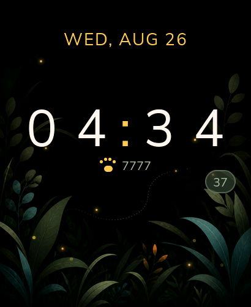

# First Clock on Waveshare — 2026-08-26

This is the continuing bench record for T-037 and T-167 / PR #270. The device
was the repository's
Waveshare ESP32-S3-Touch-AMOLED-2.06, USB serial
`28:84:85:B2:18:A4`, connected as the stable `/dev/serial/by-id/` path.

## Measured

- Source commit `0475188` built a `0x15d9a0`-byte application against the 4 MiB
  application partition, leaving `0x2a2660` bytes (66%), and was written with
  esptool verification.
- The physical 410 × 502 panel rendered the shared Clock UI: Nunito Sans time,
  localized date and live seconds over original Attadipa night-meadow art. The
  lower card, year, weekday dots and day-progress bar were removed after owner
  review so the illustration remains visible.
- The PCF85063 read returned a valid calendar. During the final capture the UI
  displayed `WED, AUG 26`, `2026`, and advanced from `00:20:32` through
  `00:30:00` across the bench run.
- Four small points remain fixed on the foliage and pulse with independent
  periods. A debug-injected tap launched a glowing point from the contact,
  moved it in one of eight directions for 1.6 seconds and faded it. The screen
  remained controllable after the animation.
- The first physical render exposed horizontal bands from the LVGL background
  gradient under the RGB565 partial-buffer path. The generated geometry was
  removed. The current exact-size RGB565 raster has no corresponding band.
- The paw and `7777` below the time are a static layout placeholder requested
  for the demo. They are not measured steps and do not establish a pedometer.
- The owner-requested demonstration ran briefly at 70% panel brightness. The
  final firmware was then rebuilt and reflashed with the repository-safe 5%
  brightness.

Final device framebuffer capture:

## Evidence boundary

- The PNG is captured from the live device through the debug protocol. It
  proves the framebuffer content and device control path, not optical colour,
  luminance or AMOLED power consumption.
- The source art is original generated Attadipa art; it is not the Waveshare
  vendor image. Prompt and provenance are recorded in
  `ui/assets/source/backgrounds/README.md`.
- The taps above were injected through the debug protocol. They exercise the same
  LVGL pointer path on the board, but it is not a fresh claim about the physical
  FT3168 sensor; physical touch was established separately by T-114.
- Reading a plausible PCF85063 calendar does not prove that it is accurate,
  UTC, local time, or synchronized. Time-source and synchronization policy is
  tracked in #264.
- T-Watch rendering remains simulator-checked here; no T-Watch was attached.
