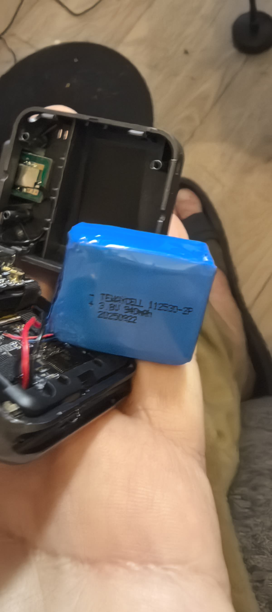
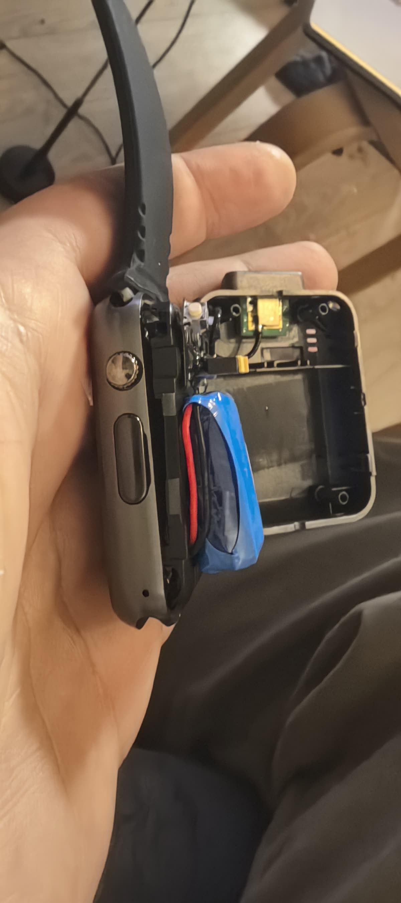
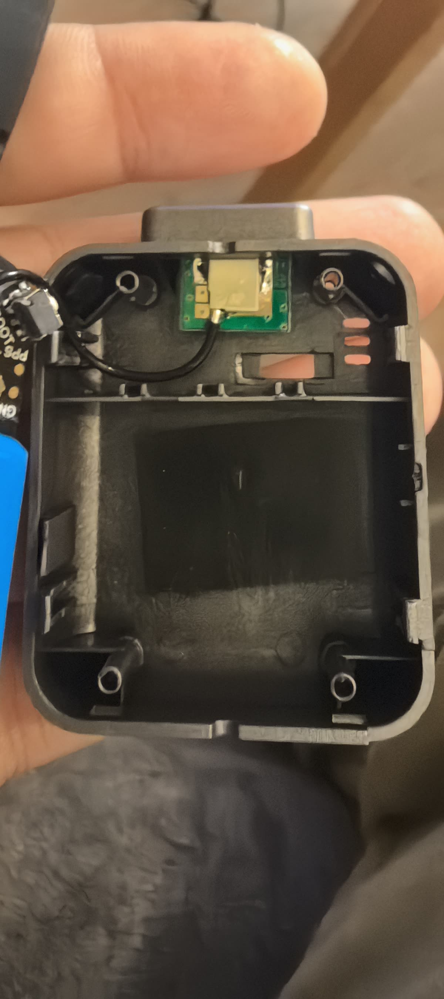

# T-Watch S3 Plus — arrival, factory backup and first read

> **Status:** MEASURED on the physical unit, 2026-08-27, on the development host
> (Raspberry Pi 5, kernel 6.18.39, `esptool v5.3.1`). Every value below was read
> off this die or out of its own flash. Nothing here is inferred from the product
> name, and nothing was written to the board.

This is the **first physical T-Watch S3 Plus the project has had.**
[OPEN_QUESTIONS](OPEN_QUESTIONS.md) A1 records the board as `ORDERED`, not
`PRESENT`, so until now every T-Watch row in
[HARDWARE_MATRIX](HARDWARE_MATRIX.md) was confirmed against a vendor document and
against no board at all.

## 1. Which unit this is

| | Value |
|---|---|
| USB serial (`/dev/serial/by-id`) | **`DC:B4:D9:18:49:40`** |
| Base MAC | `dc:b4:d9:18:49:40` |
| SoC | ESP32-S3 (QFN56) revision **v0.2** |
| PSRAM | 8 MB, vendor `AP_3v3`, `PSRAM_TEMP` 85 °C |
| Flash | **`0xEF 0x4018` — Winbond, 16 MB**, quad (4 data lines) per eFuse, 3.3 V |
| In-package flash | **none** — `FLASH_CAP` and `FLASH_VENDOR` are unset, so the part is `ESP32-S3R8` and the 16 MB is external — Winbond `0xEF 0x4018`, consistent with the schematic's `W25Q128JW`; the ordering code itself is `UNKNOWN` (§5) |
| Secure Boot | **Disabled** |
| Flash Encryption | **Disabled**, `SPI_BOOT_CRYPT_CNT = 0x0` |
| eFuse write/read protection | none — `WR_DIS = 0`, `RD_DIS = 0`, JTAG enabled, no key blocks burned |

The USB serial is the durable identifier; the `ttyACM` number is not. This is a
**third** `303a:1001` unit on a bench that already had two — see
[BENCH_DEVICES](BENCH_DEVICES.md), which needs this row.

## 2. The factory backup

| | |
|---|---|
| Path (host-local, deliberately not a repository artefact) | `~/attadipa-bench/twatch-s3-plus_DC-B4-D9-18-49-40_factory_16MB.bin` |
| Size | **16 777 216 bytes** (0x1000000, the whole part) |
| SHA-256 | **`e28f5cdd79552950d7f73fc2776023e297bfcd5dcc320d667ee065b0ebd37202`** |

Read with `tools/flash/backup_flash.py`, which refuses a chunk that is not
exactly its nominal length. **Three independent proofs that it is good:**

1. **`esptool verify-flash` over the whole 16 MB** — the MD5 is computed by the
   chip, not by the host. `Verification successful (digest matched)`.
2. **A second, independent full read**, taken separately and compared: identical
   SHA-256, and `cmp` reports the two files byte-for-byte identical.
3. **Structural parse.** `0xE9` image magic at `0x0`; the partition table at
   `0x8000` passes ESP-IDF's own `gen_esp32part.py` verification; and the `app0`
   image carries its own SHA-256 validation hash, which `esptool image-info`
   recomputes and reports **valid**, along with a valid checksum byte. A read
   corrupted anywhere inside `app0` could not produce a valid hash.

**A restore-and-boot test was NOT run.** `NOT EXECUTED — deliberately.` Writing
16 MB back adds brick risk and yields no information the on-chip MD5 has not
already given. It remains available on request.

## 3. Partition table, as read from the unit

```
nvs      data nvs      0x9000     20K
otadata  data ota      0xe000      8K
app0     app  ota_0    0x10000     4M
app1     app  ota_1    0x410000    4M
ffat     data fat      0x810000  8064K
coredump data coredump 0xff0000   64K
```

Arduino's stock `default_16MB` scheme. Everything lives **below the `0x1000000`
addressing ceiling** that `tools/flash/partition_check.py` enforces, because the
part is 16 MB — the Waveshare's 32 MB problem does not arise here.

- `app1` is `0xFF` throughout — **empty when read, 2026-08-27.**
- `coredump` is `0xFF` throughout — **empty when read, 2026-08-27.**
- `otadata` is initialised (12 non-`0xFF` bytes).

An earlier draft read those two as *"never taken an OTA"* and *"no crash has
ever been recorded"*, and neither follows. A blank partition is the state at
the moment of the dump, not a history: a reprovisioned unit has an erased OTA
slot too, and a crash that happened while coredump capture was disabled leaves
`coredump` blank as well. What is MEASURED is that both were empty when read.

## 4. The factory firmware

| | |
|---|---|
| Project name | `arduino-lib-builder` |
| App version | `45c1b25` |
| Compile time | **12 Nov 2025 10:16:32** |
| ESP-IDF | `v5.5.1-710-g8410210c9a` |
| ELF SHA-256 | `a66609047fcdd1dc7b56b72a5e8d467bab642802c5e6360510d2f99c5fe87974` |
| Entry point | `0x40376100`, 7 segments, flash DIO @ 80 MHz, image says 16 MB |

It is **LilyGoLib's `factory.ino` example**, built with PlatformIO. The build
paths survive in the binary and name the sources:
`LilyGoLibExamples/lib/LilyGoLib/examples/factory/factory.ino`,
`src/LilyGoWatchS3.cpp`, `src/GPS.cpp`, `src/LV_Helper_v9.cpp`. It links LVGL and
**NimBLE-Arduino** (`.pio/libdeps/twatchs3/`).

**The radio variant is named by the firmware's own build string:**

```
esp32:esp32:twatchs3:Revision=Radio_SX1262
```

with `LILYGO_LORA_SX1262` alongside it. That is an Arduino FQBN recorded in the
shipped binary — the first evidence for this unit's radio that is not an order
listing. It agrees with A2 and with the schematic's HPD16B3 footprint.

Peripheral strings present and matching [HARDWARE_MATRIX](HARDWARE_MATRIX.md):
`BMA423 Accelerometer`, `PCF8563`, `esp_lcd_new_panel_st7789`, `LilyGoDispSPI`.

### `ffat` holds sounds, and nothing else

Eight MP3s, 858 088 bytes total, all stamped **19 Dec 2025** — later than the
firmware build, so they are written at factory provisioning, not at link time:
`achive-sound.mp3`, `cellphone-ringing.mp3`, `funny-alarm.mp3`, `lilygo.mp3`,
`notification.mp3`, `receive-phone-calls.mp3`, `van-life.mp3`,
`vintage-phone-ringing.mp3`.

The FAT12 boot sector was found at **`0x811000`, not at the partition start** —
4 KB into it, because ESP-IDF's wear-levelling layer sits underneath. **That
offset is where logical sector zero happened to be in this dump, and it is not
a constant.** The wear-levelling layer rotates its logical-to-physical mapping
as the partition is written, so a later dump of this same unit may put sector
zero somewhere else. An extractor must read the wear-level metadata, or mount
through ESP-IDF's `wear_levelling` layer; one that always skips 4 KB will
eventually decode the wrong bytes.

### `nvs` holds no user data

Namespaces: `misc`, `nvs.net80211`, `phy`, `lilygo`, `pager`. The bulk is Wi-Fi
and PHY factory RF calibration (`cal_data`, `cal_mac`, `cal_version = 701`).
`lilygo/calibration = 1` and an 8-byte `pager` blob are the only application
state. **No credentials of any kind are in the image.**

## 5. What this resolves in the existing research

### D12b — T-Watch PSRAM, quad or octal: **octal**

Two independent lines, and the vendor document is simply wrong:

1. The die's own eFuses say `PSRAM_CAP = 8M`, `PSRAM_VENDOR = AP_3v3`. ESP32-S3
   Series Datasheet v2.2 Table 1-1 has **no 8 MB quad in-package part**, which is
   the argument [HARDWARE_MATRIX](HARDWARE_MATRIX.md) already made from the
   `ESP32-S3R8` marking — now made from the fuses of this specific die.
2. The factory firmware contains the **octal** PSRAM implementation and no quad
   one (`octal_psram`, `mspi_timing_config_psram_*` present; no quad-impl symbol),
   and the watch boots and runs. An octal-mode init against a quad part fails
   with `PSRAM chip is not connected, or wrong PSRAM line mode` and bails out.

The eFuses alone do **not** settle it — there is no quad/octal fuse — so D12b
could not have been closed by `flash-id` as its "resolved by" column suggested.
`flash-id`'s `quad (4 data lines)` describes the **flash**, not the PSRAM, and
conflating the two is exactly the trap that made the row conflicting.

### Flash: 16 MB confirmed on the unit

`0xEF 0x4018` is Winbond, 128 Mbit — read off the chip, so the **vendor and the
capacity** are MEASURED. `HARDWARE_MATRIX` had 16 MB from the vendor document;
that half is now confirmed on the unit.

**The exact ordering code stays `UNKNOWN.`** A JEDEC id names a family, not a
part number: it does not pin supply voltage, timing grade or the command set,
which is what a future BOM or a QSPI-timing decision would actually need. The
schematic's `W25Q128JW` is *consistent* with this reading and nothing more —
the package marking has not been read and the board revision is still open
(**D20**).

### Micro-USB confirmed, and the two buttons are where the schematic says

Owner-reported on the physical unit: the connector is **micro-USB**, and there
are separate **RST** and **BOOT** buttons on the GNSS daughterboard — both as
`HARDWARE_MATRIX` states from the schematic. The GNSS daughterboard is fitted.

## 5a. What the owner's teardown photographs settle

Six photographs taken by the owner on 2026-08-27, with the back cover off. They
are `MEASURED` for anything legible in them and `UNKNOWN` for anything that
needed magnification the camera did not have — the standard
[WAVESHARE_BOARD_RECEIVED](WAVESHARE_BOARD_RECEIVED.md) §0 sets.



### The cell is 940 mAh — and it is labelled 3.8 V, not 3.7 V

The label reads **`TERKDELL`, `3.8V 940mAh`, date code `20250922`**, over a type
number that reads as `112530-2P` and is only partly legible.
[HARDWARE_MATRIX](HARDWARE_MATRIX.md) carried `940 mAh, 3.7 V | VERIFIED`
from the vendor document until this change. **The capacity is confirmed off the cell itself. The
nominal voltage is not: the cell says 3.8 V.**

This is not cosmetic. A 3.8 V nominal lithium-polymer is normally a
high-voltage chemistry terminating at **4.35 V**, where a 3.7 V cell terminates
at 4.2 V, and the two are not interchangeable in either direction: charging a
4.2 V cell to 4.35 V damages it, and charging a 4.35 V cell to 4.2 V leaves
roughly a fifth of its capacity unused. **No code sets an AXP2101 charge
target voltage anywhere in this repository** — grepped repo-wide, positive
control on `AXP2101` itself, no match — so nothing is wrong today. But the
repository is not silent on that register. [BATTERY_UPGRADE](BATTERY_UPGRADE.md)
§6 and §8 prescribe writing `REG 0x64 = 011b` (4.2 V) and reading it back, and
§8 states it as a **non-negotiable with no board scope attached**, in a document
written for the *other* board's cell. Applied to a 4.35 V cell that prescription
is lossy rather than dangerous, so the existing text errs safe. The dangerous
direction is the converse — someone learning "3.8 V, so 4.35 V" here and
carrying it back to the Waveshare's 4.2 V cell, which is precisely the fire path
§8 names. What this unit turns up, then, is that a per-board register is
currently written as a global rule. Whoever sets it first on either board must
resolve this, and the label alone does not: it states a nominal, never a
termination.

Filed as a new open question rather than an answer. The one cheap resolution is
to read what the *factory* firmware programs into the AXP2101 `CHG_V` field
(`REG 0x64[2:0]`) over I2C while it charges — a bench read this session did not
attempt, but **not an untried method**: the same read was taken on the Waveshare
unit from a RAM app that changed nothing, giving `CHG_V_CFG = 0x03` = `011b` =
4.2 V ([WAVESHARE_RUNNING_OUR_CODE](WAVESHARE_RUNNING_OUR_CODE.md) §3). It costs
no flash write, and on this unit it would read the vendor's own answer for the
vendor's own cell. **The Waveshare value is a prior for the method and not for
this cell** — different cell, different board, different vendor firmware. It
says the read works, not what this battery terminates at, and the
re-confirmation stays `UNKNOWN` until somebody reads *this* unit's `0x64`.

Recording the density observation without leaning on it: `112530` decodes to
11.0 × 25 × 30 mm = 8.25 cm³, so 940 mAh at 3.8 V is 114 mAh/cm³, above the
87–102 band [BATTERY_UPGRADE](BATTERY_UPGRADE.md) §1 established. That band was
built from 3.7 V cells and a different chemistry does not have to sit inside it,
so this is a reason to weigh the number, not to disbelieve it.



### There really are two side controls, and the upper one is a knurled crown

The upper control is a **round, knurled, polished metal crown**, physically
distinct from the flat rectangular button below it. That is much better evidence
than §6's string search: knurling is what a part meant to be *turned* looks
like. It still does not prove the crown rotates, and it says nothing about
whether anything reads the rotation — see §6, which stands.



### The GNSS daughterboard is fitted, and its `PPS` pad is exposed

Silkscreen legible on the daughterboard: **`PPS`, `BOOT`, `GND`, `ANT`, `IO`**.
A u.FL coaxial lead runs from it to a **ceramic chip antenna on a separate small
PCB clipped into the back cover**. So the GNSS daughterboard that
[HARDWARE_MATRIX](HARDWARE_MATRIX.md):103 "13-pin 0.3 mm FPC daughterboard"
describes is physically present and
antenna-fed on this unit — previously a schematic-only fact — which is also why
BOOT and RST exist at all on this board — `docs/research/HARDWARE_MATRIX.md:113` — "BOOT (GPIO 0) and RST both sit"
and `docs/research/HARDWARE_MATRIX.md:231` — "BOOT button, on the GNSS daughterboard"
— and why the hardware download-mode entry in §7 worked.

`PPS` being an exposed pad rather than a buried net matters to
[#264](https://github.com/hleserg/Attadipa/issues/264): the matrix says the
signal "appears nowhere in the main-board schematic", and a pad is the
difference between *not routed* and *not reachable*. A wire from it to a spare
GPIO is a disciplined time source. Not attempted, not measured, and it is a
soldering iron on a shipped board — noted as available, not recommended.

### The retail box says `T-WATCH-S3`, with no `Plus` and no GPS

`LILYGO T-WATCH-S3 · Wearable & Programmable · ESP32-S3 · LoRa | Speaker |
Microphone`. No `Plus`, and GPS is not among the three features it advertises —
yet the GNSS daughterboard above is fitted, and the shipped firmware's FQBN is
`esp32:esp32:twatchs3:Revision=Radio_SX1262` (§4), which also carries no `Plus`.
Recorded as an observation about **packaging**, not as a claim about the board:
this project's own naming comes from the schematic filename
`T-Watch-S3-Plus-GPS V1.0 2025-04-29.pdf`, and a vendor reusing one carton
across a variant family is the ordinary case. It does not make D20 — the board
revision — any less open.


## 6. What is still UNKNOWN, and one thing that is new

- **GNSS model — `UNKNOWN`.** The dump names no receiver; the only GNSS string is
  `NMEA to Serial`. u-blox MIA-M10Q vs Quectel LS550G is unresolved. §5a confirms
  the daughterboard is *fitted and antenna-fed*, which narrows nothing about
  which receiver is on it: resolving that needs a UBX/NMEA version poll on the
  running board, or the part marking under a loupe.
- **Panel diagonal (D15) — `CONFLICTING` then, `RESOLVED` since.** Nothing in
  the firmware states a physical size; a photograph did — 1.54", 220 ppi (D15).
- **Board revision (D20's T-Watch counterpart) — `UNKNOWN`.** Not readable from
  flash; it needs a loupe on the silkscreen.
- **NEW, and in no document: the unit has a crown-shaped side control.**
  Owner-reported, and §5a photographs it: a round knurled metal crown above the
  flat button. `HARDWARE_MATRIX` lists only BOOT, RST and PWR for this board, and
  PWR reaches the AXP2101 `PWRON` pin rather than a GPIO, so nothing documented
  accounts for it. **The factory firmware contains no rotary, encoder, knob,
  crown, wheel or dial string at all** — which is absence of evidence and not
  evidence of absence: an encoder polled through plain GPIO leaves no such string
  behind. So there is no evidence the shipped firmware reads a rotation, and no
  proof that it does not. Two readings survive: the PWR button (SW7) in a
  crown-shaped cap, or a real rotary encoder on GPIOs the schematic sheets this
  project holds do not cover. Knurling is what a part meant to be turned looks
  like, which favours the second, but a photograph of a knurl is not a
  measurement. **Tested: the owner turned it in the running factory UI on
  2026-08-27 and nothing happened.** That is a `MEASURED` negative and it is the
  strongest evidence here, but it is narrower than it sounds — it rules out *the
  factory firmware acting on a rotation*, not the crown rotating and not an
  encoder existing on the board. What still separates the two readings is
  continuity from the crown to a GPIO, with a meter, on an opened case.

## 7. Two host-side facts the next session will otherwise rediscover

Both cost about an hour here.

### The software reset does not work on this unit, in either direction

`--before default-reset`, `usb-reset` and `no-reset` all fail with
`No serial data received`, and `dmesg` records **zero** USB re-enumeration during
the attempt — the chip never resets. **Download mode has to be entered by hand:
hold BOOT, tap RST, release BOOT.** The chip then waits in ROM download mode
indefinitely, so there is no timing to coordinate.

**`--after hard-reset` does not work either, and this report said otherwise
before the owner checked.** esptool prints `Hard resetting via RTS pin` and the
device re-enumerates on the USB bus, and that was written up here as the chip
rebooting into its factory application. It was not. **An ESP32-S3 re-enumerates
while sitting in the bootloader too** — the USB-Serial/JTAG peripheral is in ROM,
so re-enumeration says the chip restarted its USB stack and says nothing about
what it restarted into. The owner then reported the watch dark until they
**pressed RST by hand**, at which point the interface came up. So the unit was
still in download mode, and the only reset ever demonstrated on this board is a
physical one. Corrected rather than quietly dropped, because the wrong version is
the more useful-sounding one and would have been believed.

**The practical rule is unchanged, but its justification is weaker than it
looked.** Every esptool invocation here carried `--before no-reset --after
no-reset`, adopted as a precaution against a reset between chunks dropping the
chip out of download mode, and the whole 16 MB read cleanly under it. Whether a
hard reset between chunks would in fact have broken the read was never tested —
on this evidence it probably would not have done anything at all.
`backup_flash.py` shells out as `[python, -m, esptool, ...]` and does not pass
those flags, so a wrapper was supplied through its `--python` option rather than
editing the script.

### The first USB control transfer after every `open()` fails with `EPROTO`

Measured: of 20 RTS/DTR toggles on one open port, **only the first failed**;
`errno 71` on `TIOCMBIC`. pyserial swallows `EINVAL` and `ENOTTY` but not
`EPROTO`, and esptool closes and reopens the port on each retry — so it meets the
one failing transfer every single time and never gets past it. The other bench
ESP32-S3 does not do this. A retry **in place**, without reopening, clears it:
`serial.serialposix.Serial._update_rts_state` / `_update_dtr_state`, wrapped to
retry on `EPROTO`. Installed via a `.pth` in the tool venv, because Debian ships
its own `/usr/lib/python3.13/sitecustomize.py` which shadows one placed in
`site-packages`.

### And the reason the watch looked dead on arrival

It enumerated once, stopped answering control transfers, then dropped off the bus.
The cause was the `MSK12C02-HB` slide switch
([VERIFIED_FACTS](VERIFIED_FACTS.md) §Smaller findings) in the **off** position:
USB is `charge + programming only, no external supply function`
([HARDWARE_MATRIX](HARDWARE_MATRIX.md)), so the board cannot run on USB alone.
The research predicted the symptom before the board was opened. **Check that
switch first.**
