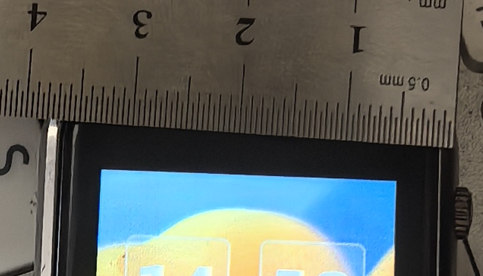

# The T-Watch S3 Plus panel is 1.54", 220 ppi — one photograph, re-derived

Bench measurement of 2026-08-28, issue
[#311](https://github.com/hleserg/Attadipa/issues/311), closing OPEN_QUESTIONS
**D15**. The vendor's own documentation and the vendor's own schematic
disagreed about the size of this panel by 19 %, and the disagreement had been
resolved in the wrong direction — 1.3" was the working value because it was the
conservative one, not because anything supported it.

**Nothing was flashed, written or reset.** The watch was running its factory
application, showing the Clock face. The only instrument was a steel rule.

## 1. What this report contains, and what it does not

The measurement was first made from two full-resolution photographs taken on
2026-08-28. **Those frames were not retained**, and neither was the second
photograph in any form. What survives, and what is committed here, is one crop
of the first frame:
[`twatch-s3-plus-panel/panel-and-rule.png`](twatch-s3-plus-panel/panel-and-rule.png).

That single crop is enough, because it happens to contain both things a length
measurement needs at one scale: a graduated steel rule, and both vertical edges
of the lit active area.

Everything below is therefore **re-derived from the committed image**, today, by
[`twatch-s3-plus-panel/measure_panel.py`](twatch-s3-plus-panel/measure_panel.py):

```
python3 docs/research/twatch-s3-plus-panel/measure_panel.py
```

The first pass reported 27.76 mm ± 0.15 from 433.5 × 432.5 px at 15.60 px/mm,
with a 2.3° rotation and a 63 mm working distance. **Those intermediates are
not repeated as facts anywhere in this repository**, because the frames they
came from are gone and nobody can check them. This report keeps the numbers the
committed image reproduces — 27.72 mm from 429.5 px at 15.53 px/mm — and the
0.04 mm between the two passes is the honest size of the difference that
different crops and different edge criteria make.

Two consequences of having one crop rather than two frames, stated rather than
buried:

- **Only three of the four edges are in the picture.** The bottom edge is below
  the crop. The panel is treated as square because its raster is 240 × 240, not
  because this photograph shows it to be.
- **The working distance is not recoverable**, so the depth systematic in §5 is
  bounded across an assumed range and labelled `ESTIMATED` rather than computed.
  An earlier draft of the matrix argued from a 63 mm working distance to an
  ~85° horizontal field; that figure was arithmetically wrong — 85° at 63 mm
  needs a 115 mm frame, twice the calibrated span — and it is deleted rather
  than corrected, because the exclusion in §4 never needed a field of view.

## 2. The photograph



The rule lies **on the watch case**, its graduated face towards the camera,
coplanar with the cover glass. That placement is the whole method: it removes
parallax between standard and subject instead of bounding it. An earlier
attempt with the rule on the desk *beside* the watch could yield only an upper
bound and was reported as one.

The panel is lit and showing the factory Clock face, so the boundary being
measured is the emitting area — which is what a display's diagonal specifies —
and not the bezel, the glass or the case.

## 3. The length standard — MEASURED

The rule carries two graduated edges, stamped `mm` and `0.5 mm`, numbered 1..6.
The script does not take the value of a graduation from those stampings. It
measures the ratio:

- fine graduations, fitted over 674.6 px: pitch **7.7647 px**, residual **0.287 px** rms
- numbered divisions, fitted over the same frame: pitch **155.842 px**
- **ratio 20.071**

Twenty fine graduations to a numbered division is the only arrangement a rule
stamped both `mm` and `0.5 mm` admits. So a numbered division is 10 mm, the
numbers are centimetres, and one fine graduation is 0.5 mm — **15.529 px/mm**.
The numbered divisions give **15.584 px/mm** independently, a **0.35 %**
disagreement, which is the cross-check that matters: the two scales come from
different marks at different places on the rule.

Twenty consecutive intervals, in px, and each as a count of the fitted pitch:

```
 7.83   7.83   7.83   7.48   7.99   7.81   7.80   7.52   7.87   7.85
 1.01   1.01   1.01   0.96   1.03   1.01   1.00   0.97   1.01   1.01
 7.58   7.81   7.80   7.78   7.70   7.86   7.64   7.94   7.59   7.96
 0.98   1.01   1.00   1.00   0.99   1.01   0.98   1.02   0.98   1.03
```

## 4. The active area, and why 1.3" is excluded — MEASURED

Three edges are fitted by least squares, each from the sub-pixel crossing where
blue passes half way between the dark bezel and the lit interior:

| edge | samples | fit | residual |
|---|---|---|---|
| left | 94 rows | `x = -0.05309·y + 159.180` | 0.195 px rms |
| right | 94 rows | `x = -0.02913·y + 581.635` | 0.120 px rms |
| top | 320 cols | `y = +0.03902·x + 239.067` | 0.110 px rms |
| bottom | — | **NOT MEASURABLE** — below the frame | — |

The frame is rotated. The two side edges read **+3.04°** and **+1.67°** off
vertical, the top edge **+2.23°** off horizontal, and the rule's graduations
**+4.00°** off vertical. A horizontal scan crosses graduations and panel edges
alike at `1/cos(tilt)`, so most of the rotation cancels in the ratio and only
the difference between the two tilts survives — worth **0.16 %**. Both are
applied anyway, because the two angles are measured on different features and
agree only to the extent that the rule really was laid parallel to the case.

That the two side edges do **not** share one tilt is the frame telling us the
camera was not square to the case: there is perspective here as well as
rotation, and §5 does not stop at the fit residual because of it.

- horizontal separation **429.85 px**, **429.48 px** after the rotation correction
- **active width 27.72 mm — MEASURED**
- diagonal of a 240 × 240 square: **39.21 mm = 1.544"**
- **219.9 ppi**

| candidate | predicted active width | measured 27.72 mm is |
|---|---|---|
| 1.54" | 27.66 mm | **+0.2 %** |
| 1.30" | 23.35 mm | **+18.7 %** |

**1.3" is excluded, not merely disfavoured.** Reaching it would require the
image scale to be wrong by 19 % — and the scale is set by the rule's own
graduations, which the fit in §3 shows to be uniform to about 1 % of one
graduation across the whole calibrated span, on two independent sets of marks
that agree to 0.35 %. A 19 % scale error would have to appear as 19 %
non-uniformity in exactly those marks. It does not.

## 5. What the number is worth

**Statistical.** The measurement was repeated 16 times over four different
graduation bands and four different row windows — deliberately different
pixels, not a re-run:

```
spread                 27.700 .. 27.729 mm (0.029 mm)
graduation fit rms     0.287 px = 0.019 mm
edge fit rms           0.195 px = 0.013 mm
```

**Systematic, and two-sided.** Two terms of comparable size point in opposite
directions. Neither is bounded tightly, and they do not cancel by construction.

**(a) Depth — raises the true width.** The rule rests on the case rim; the
emitting layer sits behind the cover glass, further from the lens. The
calibration is therefore taken in a plane *nearer* the camera than the plane
being measured, px/mm comes out too large, and the width comes out too **small**.

Its size needs the working distance, which this crop does not carry, so it is
bounded across a plausible range instead — `ESTIMATED`, from the geometry
`Δ = w·d/(D−d)`:

| rim-to-emitter depth | at 120 mm | at 200 mm |
|---|---|---|
| 1 mm | +0.23 mm | +0.14 mm |
| 2 mm | +0.47 mm | +0.28 mm |
| 3 mm | +0.71 mm | +0.42 mm |

The glass reduces the effective depth: an emitter under `t` of glass images at
an apparent depth of about `t/n`, n ≈ 1.5.

**(b) Perspective — lowers it, and §4 named this without sizing it.** The two
side edges do not share a tilt, `+3.04°` against `+1.67°`, so the camera was not
square to the case and the frame carries a vertical magnification gradient. The
fitted edges size it, because apparent width is a function of image row:

```
x_L(y) = -0.05309·y + 159.180
x_R(y) = -0.02913·y + 581.635
W(y)   =  0.02396·y + 422.456
```

The scale is read from the rule at row **162** (`FINE_BAND`), where `W` is
426.34 px. The panel is measured at row **308.5** (`PANEL_ROWS`), where `W` is
429.85 px — §4's own figure, so the model is this report's rather than an
outside one. The local scale where the *standard* is read is therefore
**0.82 % smaller** than where the *subject* is measured, px/mm comes out too
small, and the width comes out too **large** — by **0.23 mm**, giving 27.50 mm.

`ESTIMATED`, and of the same class as (a): it extrapolates the panel plane's
gradient up to the rule's rows, assuming both planes share the perspective law
and that it is linear across the span.

**Neither term decides which panel this is.** Both stay an order below the
**4.3 mm** that separates the two candidate diagonals. Even at 27.50 mm the
result is **+17.8 %** from 1.3" and 221.7 ppi, so 1.3" stays excluded and
"220 ppi" stays true whichever way the band is read.

Quoting `27.72 ± 0.03` alone would therefore be tighter than the method
supports. The honest statement is **27.72 mm, −0.2 to +0.7 mm two-sided,
1.54"**.

## 6. What this changes, and what it does not

The schematic was right and LilyGoLib's specification tables — which name the
S3 Plus explicitly — are wrong. The part number on the schematic's LCD sheet,
`QT154C2408` with symbol `LCD_1.54-TOUCH`, decodes to the same answer
independently, and that agreement was already in
[HARDWARE_MATRIX](HARDWARE_MATRIX.md) before this measurement existed.

Density is **220 ppi, not 261**. Every `Metrics::px` conversion at 261 dpi
yields about 19 % more pixels than the panel wants, so this board renders
oversized today. `platform/src/board_profiles.cpp` and the asset pipeline still
carry the placeholder; [#323](https://github.com/hleserg/Attadipa/issues/323)
corrects them.

**Not established here:**

- the panel is square — taken from the 240 × 240 raster, not from this
  photograph, whose fourth edge is missing;
- the bezel, glass or case dimensions — nothing here measures them;
- anything about the panel's colour, brightness or viewing angle. This is a
  measurement of one length.
