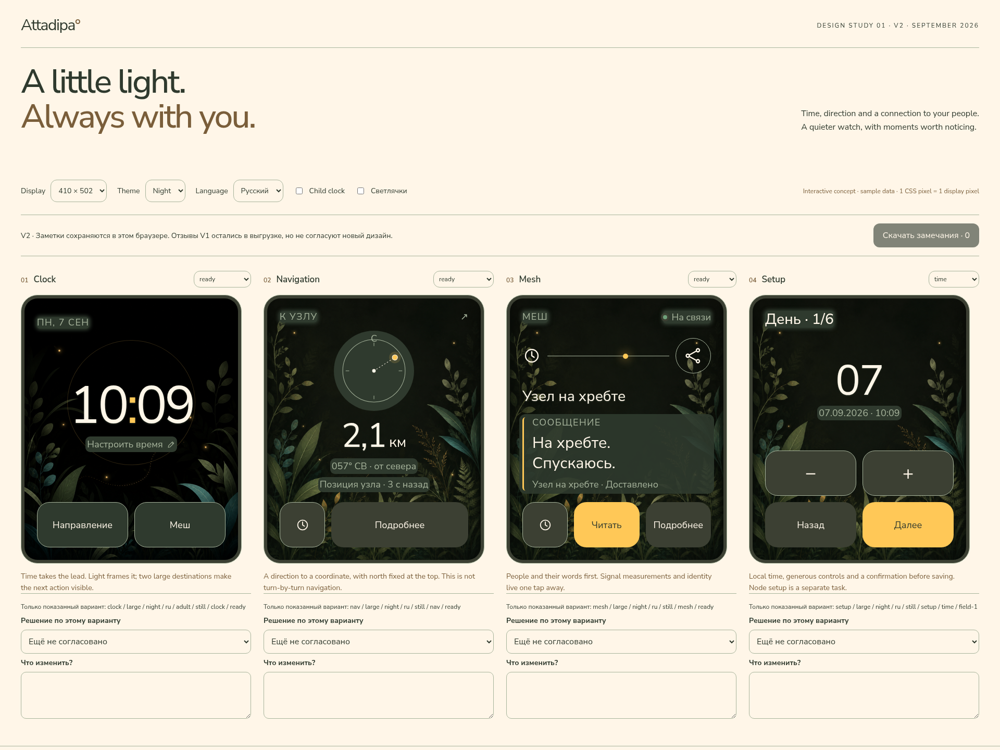

# A little light — design study 01, revision V2

[Open the interactive study](prototype/index.html). Work and acceptance criteria
live in [#476](https://github.com/hleserg/Attadipa/issues/476). This is a design
deliverable for the existing Clock, Navigation, Mesh and provisioning features.
It does not change firmware, application state machines or the canonical palette.



[Small day study, 240 × 240](prototype/preview-small-day.png).

## Open it locally

From the repository root:

```sh
rtk python3 -m http.server 8476 --bind 127.0.0.1 --directory docs
```

Open `http://127.0.0.1:8476/ui/prototype/`. Display, theme and language are
review controls. Every watch surface is native-sized: 410 × 502 or 240 × 240 CSS
pixels, with no transform or zoom. Use browser zoom 100% for the pixel inspection;
physical millimetres still depend on the monitor. Values and outcomes are sample
data, and nothing connects to a watch, writes a credential or changes a clock.

All runtime assets are bundled beside the page, including the project's pinned
Nunito Sans font and its [SIL OFL licence](prototype/OFL.txt). No framework,
package installation or external request is required. Serving only `docs/`
matches GitHub Pages and exposes accidental dependencies outside that root;
run `prototype/selftest.js` in a freshly loaded page's browser context to check it.

The bundled TTF is an unchanged export of `tools/font/fetch_ttf.py`; the bundled
clock raster is an unchanged copy of
`ui/assets/source/backgrounds/clock_meadow_night_410x502.png`. Their canonical
sources and the canonical licence in `assets/fonts/OFL.txt` stay in place.
The existing documentation check rejects missing or changed copies, including
a font that no longer matches the generator's SHA-256 pin. To refresh these
copies from the repository root:

```sh
rtk python3 tools/font/fetch_ttf.py --out docs/ui/prototype/NunitoSans.ttf
rtk cp assets/fonts/OFL.txt docs/ui/prototype/OFL.txt
rtk cp ui/assets/source/backgrounds/clock_meadow_night_410x502.png docs/ui/prototype/
```

Query parameters `size=small`, `theme=day` and `locale=en` select a repeatable
review configuration.
Add `motion=off` for a reproducible still review. The Fireflies checkbox controls
decorative movement; the operating system's reduced-motion preference overrides it.

### Agree a design in the browser

Each card has a decision (not reviewed / approved / changes requested) and a
comment. Feedback belongs to the displayed card, geometry, theme, language,
page and state, effective motion choice, and child/adult setting on the clock
only; time fields and passkey steps are distinct.
Changing a variant does not carry its approval into another variant. The review
namespace must change when the design is revised. The example values are not a
separate approval scope; the export includes screen text captured at the edit.
V2 uses a fresh namespace. V1 notes are retained and exported as **previous
design** feedback, never silently promoted to approval of V2.

Only review metadata uses browser `localStorage`. It survives reloading on the
same origin and browser profile; private browsing, clearing site data or moving
to another port can remove or hide it. A storage failure is shown visibly and
the in-memory notes remain downloadable. One unreadable record does not prevent
other records from loading; its raw text is included in the export for recovery,
and that variant cannot overwrite the unreadable record. Use one review tab: simultaneous edits
to the same variant are last-write-wins, with no shared reviewer accounts.

**Download review** exports the decisions, comments, variant identifiers and
screen text to `attadipa-design-review.txt`. Attach that file in the design
conversation to hand it to Codex/Claude. The page does not send feedback to an
agent or GitHub automatically. Approval here is design feedback, not acceptance
of an implementation on the watch.

## What the existing interface says

The starting point is the owner's [visual references](reference/README.md),
[DESIGN_SYSTEM](DESIGN_SYSTEM.md), and master specification §§39–55. The design
language is warm ivory, dark olive, amber light, rounded type, restrained natural
imagery and an adult-friendly insect mascot. Red is not added.

The inspected LVGL baseline contains useful work worth retaining: the clock's
meadow artwork, a north-up navigation display, honest service states and bounded
Mesh preview rows. The gap is composition and interaction across those features:

| Surface    | Observed problem                                                             | Design response                                                                                 |
| ---------- | ---------------------------------------------------------------------------- | ----------------------------------------------------------------------------------------------- |
| Clock      | Time is widely spaced; setup is reached through a hidden hold                | Compact stable HH:MM, visible time-edit affordance, two large destinations                      |
| Navigation | On 240 px, the explanation competes with the coordinate reading              | Compass and distance share a row; age remains visible; the fix qualification remains in Details |
| Mesh       | Node key, MTU and signal metrics dominate a technical status sheet           | Human-readable node name and message first; measurements and identity behind Details            |
| Setup      | Dense universal keypad, UTC mental arithmetic, refusal styled as instruction | Focused local-time task, separate node task, large steppers, explicit review before save        |

The baseline was captured with the existing local `build-sim/sim/attadipa_sim`,
reporting `sim 0.0.1`; it is not asserted to be a fresh build of this branch.
Both geometries, both themes and both languages were represented in the baseline
inspection. Clock hold-to-setup and an invalid-date rejection were also driven
through `tools/watch_control.py` over separate debug sockets. The screenshots
were opened, including the rejected value and the undersized 240 px keypad.

## Composition rules

The watch has one primary fact: time, distance, message, or the value being
edited. A luminous detail supports that fact. It does not become a second
dashboard or a fictional measurement. V2 adds owner-requested decorative motion
under the limits below; no information depends on seeing an animation.

The night clock keeps the existing meadow artwork at full opacity, without a
blur or the V1 28% opacity reduction. The dial becomes an almost invisible
amber enclosure around stable HH:MM; no seconds badge occupies the field. The
whole time area is the edit target, and its caption makes that action visible.
On the small display, decorative elements yield to type and touch areas.

Navigation keeps the already accepted north-up interpretation. The target mark
and wearer dot are distinct. The sketch's 057° is an example bearing, not a
command to turn 57°. Do not use this static study to replace the implemented
head-up states or their heading-quality rules. Production must retain those
states and expose orientation and source qualification explicitly.

Mesh uses a short light path between watch and node as a connection illustration,
with botanical background art. It does not show a map or imply a radio topology. A message preview has
an explicit Read action. Long text gets its own scrollable reading surface;
the Back control remains fixed and available. Stale states retain the last data
and their age/connection qualification when opening and closing Details.

Lumar belongs in waiting, missing-provider and completion moments. The study uses
one derived six-legged illustration; its presence is deliberate, not a mascot
on every operational screen. A child-clock variant makes its role larger and
uses the child target size. Child Navigation/Mesh interactions need their own
design before production; this study does not claim those flows are complete.

Day is genuinely light in this proposal; night is olive and restrained. The
browser's luminous path is a visual reference, not a request for a costly blur
in LVGL. A production implementation should use the existing raster/image and
token mechanisms and measure the memory/flash cost. Brightness, sunlight
readability, panel colour and energy use remain hardware questions.

### V2: visible artwork and a little movement

The owner's V1 review requested clearer clock artwork, raster beauty on
Navigation/Mesh/setup, and a few moving fireflies. Two new botanical studies
share the same garden: a dark clearing for non-clock night screens, and a
genuinely sunlit ivory scene for day screens. They are not a washed-out night
image. All backgrounds are fully opaque, unblurred raster layers, composed with
quiet centres and detailed edges. Text-dense areas have local reading surfaces;
the whole background is not covered by a dimming sheet. The original night
clock raster and the canonical reference sheets are unchanged.

The browser animates three small amber lights in the outer gutters with a
12-second CSS transform/opacity cycle. Their flight paths stay outside the
content inset; they neither carry status nor follow a compass target. Movement
pauses while a screen is pressed, when a card is offscreen, and when the page is
hidden. It is absent on failure screens. The review checkbox removes it, and
`prefers-reduced-motion: reduce` removes it regardless of the checkbox. Day
lights are softer. The image itself never moves or blurs.

This is a browser motion proposal, not a firmware performance claim. An LVGL
implementation must re-derive production assets for each geometry and use an
inexpensive sprite/primitive path, not ship these desktop-resolution PNGs or
copy CSS blur. Physical frame rate, power and panel response are **UNKNOWN**;
validation is **NOT EXECUTED — HARDWARE REQUIRED**. The static mode remains a
complete UI if animation is rejected by the production budget.

## Setup: change the task, then the pixels

The proposed entry screen offers **Local time** and **Node passkey** as separate
tasks. Changing a node must not require re-entering the date. Setting the clock
must not require a node.

Local time edits day, month, year, hours, minutes and UTC offset in six explicit
steps. The displayed date/time stays together, each step can go back, and the
final review shows the local value plus the derived UTC date/time. Save is the
only commit point. Until then Back/Close discards the draft. Existing valid
values should seed production entry; an unknown clock must not silently seed
the sample date from this study.

Years 2000–2099 and offsets −12:00…+14:00 match the current application model,
as checked with Claude in [the integration contract](https://github.com/hleserg/Attadipa/issues/476#issuecomment-5586036185).
Quarter-hour entry is a UI decision, not a restriction on stored offsets or the
shared API. Production must preserve an existing `+05:07` until this field is
deliberately changed; plus first moves to `+05:15`, minus to `+05:00`, then each
press advances 15 minutes within the bounds. The signed value crosses zero
through the same two buttons; no separate sign control is needed. The browser
uses an on-grid sample, not a legacy-storage integration test. Claude must test
unchanged legacy values, both edit directions, UTC rollover, leap days and
shorter-month clamping. This is a fixed offset, not an automatic DST feature.

Cancellation preserves the originating clock's missing/stale state; only a
successful Save makes it ready. A failed write must not promise rollback:
production shows “Time save not confirmed.” / “Сохранение времени не подтверждено.”
and retains the draft for Retry/Back without success art. The browser's `failed`
scenario is a passkey failure, not evidence of this production time-write path.

A passkey is edited one digit at a time. Leading zeros survive; Back edits the
previous digit; submitting six digits enters Pending. A stored passkey produces
“Passkey saved / Connection is still being checked”, never “Connected”. A service
failure must retain the entered value for retry and must not draw success art.
Leaving Pending must not let a late response replace the screen the user moved
to. The prototype models this timing boundary; only the real service can prove
credential persistence and radio success.

For an existing node, Keep and Forget are explicit actions. Forget requires a
second confirmation naming the consequence. Cancel keeps both bond and identity.
Keep and Back leave the credential unchanged and return to the entry context,
including refused-node Mesh details; neither opens the passkey editor.
The subsequent outcome must preserve `MeshForgetOutcome` distinctions; the
browser's simple success example is not a replacement for that state machine.

### Touch arithmetic and the cost of this choice

| Display   | Editable row                                 | Bottom actions          | Minimum used |
| --------- | -------------------------------------------- | ----------------------- | ------------ |
| 240 × 240 | 218 px − 6 px gap = two 106 × 61 px buttons  | Two 106 × 61 px buttons | Adult 61 px  |
| 410 × 502 | 362 px − 12 px gap = two 175 × 87 px buttons | Two 175 × 87 px buttons | Adult 87 px  |

This meets the existing design-system target **in browser geometry**. It does
not establish finger accuracy. The price is more actions than a numeric keypad:
six date/time components and six passkey digits. A user can decrement as well as
increment; a digit wraps, while date/time components stop at their valid limits.
Bench task-completion time and input errors are UNKNOWN. If that burden is too
high on the large panel, compare a native roller or the #469 4 × 4 proposal;
do not shrink the small panel's controls to claim parity. A roller is not
implemented by this study.

## Handoff to Claude: integration contract

These are tasks inside the current UI work, not an additional automation queue.
Agree the exact seam in #469/#476 before editing. Where a face interface and a
board caller must change, deliver **one coordinated PR** and build both callers.
Codex owns visual implementation and the rendered review. Claude owns the
application/firmware work below; production implementation remains outstanding.

| Task for Claude                                                                                                                               | Acceptance evidence                                                                                                                                                                                |
| --------------------------------------------------------------------------------------------------------------------------------------------- | -------------------------------------------------------------------------------------------------------------------------------------------------------------------------------------------------- |
| Separate clock editing from node provisioning; provide a local-time draft and explicit save operation using the existing Provisioner          | Real application tests show no write before Save, cancel leaves the old clock unchanged, fixed-offset conversion crosses date boundaries correctly, and node-only entry never calls set_wall_clock |
| Expose state needed by the face without guessing it: current field, step/total, draft, instruction, verdict, saved summary, pinned-node state | Pending and failure are reachable through the real simulator entry; saved passkey and confirmed link stay distinct; review shows actual submitted values                                           |
| Wire visible Clock → Navigation/Mesh/setup and consistent Back actions in the composition roots                                               | Real `watch_control.py` tap journeys exercise both panel profiles; input does not fire twice or lose the return state; source/heading degradation is preserved                                     |
| Provide message reading and qualified Details from the existing formatted data                                                                | Long UTF-8 names/messages remain bounded in the preview and readable in full; stale data never becomes Ready on return; refused-node identity and forget outcomes remain distinguishable           |

Do not port CSS literally or copy the sample data into application defaults.
Reuse `ClockFace`, `NavFace`, `MeshFace`, `ProvisionFace`, the existing l10n
catalogues and semantic tokens. The study intentionally leaves firmware
interfaces untouched, so no platform-specific code is introduced into `apps/`
or `ui/` by this PR. Hardware evidence continues to live in the research area.

## What was checked

The review page has one runnable browser check in
[`prototype/selftest.js`](prototype/selftest.js). It drives the actual page's
selects and buttons, checks every exposed scenario across geometry/theme/locale,
checks target rectangles and content overflow, then walks date clamping, UTC
rollover, save, forget cancellation, digit wrapping and the pending/late-response
boundary. It also checks review persistence, variant isolation, plain-text
handling, the real export button, corrupt-record recovery and a storage-failure
path without keeping its test notes. V2 additionally requires a loaded Nunito
font, decodable raster files, localised Mesh details, both success receipts,
distinct failure art and moving/stopped fireflies. It is evidence about the
prototype, not the production caller.

V2 passed 1,825 assertions with motion available and 1,821 with system reduced
motion (the four particle-dependent assertions are skipped). A separate page reload
restored a valid note alongside a corrupt record and kept the latter exportable;
temporary browser test records were removed afterward. A deliberately missing
font produced the expected failed assertion instead of accepting fallback type.
Failure and passkey-success screens were also opened on both geometries, and
two animated frames were compared for the restrained edge-light movement.
The check also covers secondary-text reading surfaces, including empty/pending
instructions, Details qualifications and full-message senders, and moving
fireflies after navigation with keyboard focus retained. A real
pointer down/up check verified pause while held and resumption after release.
The matrix also covers unchanged Keep/Back exits, refused-node return, cancelled
missing/stale clocks, successful Save and matching night navigation-header
reading surfaces. Both geometries, themes and locales were opened after these
journeys; the committed overview captures were refreshed with fireflies enabled.
Scenario selectors follow in-card navigation and both success receipts; other
screens show a localized placeholder. Native keyboard selection also restored
the no-fix scenario after leaving and returning, without synthetic change events.

With Chromium and `agent-browser` available:

```sh
rtk npm exec --yes --package=agent-browser -- agent-browser --executable-path /usr/bin/chromium --session attadipa-design open http://127.0.0.1:8476/ui/prototype/
rtk npm exec --yes --package=agent-browser -- agent-browser --session attadipa-design eval '(async () => eval(await (await fetch("selftest.js")).text()))()'
```

The check returns a `passed` boolean and failure descriptions. A false result
must be treated as failure even though the browser command itself can exit zero.
The browser helper is optional review tooling, not a project dependency.

| Evidence                           | Result and boundary                                                                                                                        |
| ---------------------------------- | ------------------------------------------------------------------------------------------------------------------------------------------ |
| Browser state/geometry check       | Passed; production models are not exercised by this check                                                                                  |
| Eight native-size gallery captures | Both sizes × both themes × both languages; opened for type, composition, clipping and touch affordances                                    |
| Interactive journeys               | Time editing, node confirmation, message/details/back, pending and late completion checked in the browser                                  |
| LVGL baseline                      | Existing Clock, Navigation, Mesh and entry captured and inspected; clock hold and invalid-date rejection driven through the real simulator |
| Physical display/touch/power       | **NOT EXECUTED — HARDWARE REQUIRED**; no connected serial watch was found                                                                  |

The two committed review sheets are reading aids, not firmware goldens. The
complete gallery and state captures are local evidence in `artifacts/ui/476/`.
The implementation needs its own LVGL screenshots and shipping-seam tests before
any claim that these changes work on a watch. Russian in this browser does not
change the firmware's locale selection.

## Illustration provenance

`prototype/lumar-study.png` is a new study asset generated with the built-in
OpenAI image tool on 2026-09-07, using `reference/lumar_mascot_sheet.png` as the
identity reference. The canonical source sheet is unchanged. The accepted study
has six visible insect legs and an olive background. It is an RGB raster, not
a transparent sprite, and is not linked into firmware; its approximately 1.1 MB
PNG size is a repository asset cost, not an embedded-flash measurement.

The first generation was rejected: it had four apparent legs and a painted
checkerboard rather than alpha. It is not used or committed. Final prompt:

> Use case: illustration-story. Input is the canonical identity reference for
> Lumar. Create a derived simple small smartwatch illustration, one full body
> Lumar firefly hovering quietly, adult-friendly 2D flat ink illustration. SOLID
> UNIFORM DARK OLIVE #2F3A2E background, no transparency, no checkerboard, no
> texture. Crucial anatomy: SIX SEPARATE VISIBLE INSECT LEGS, THREE on each side
> of the dark olive thorax, arranged spread out so every leg can be counted, do
> not hide any legs behind the body. Two antennae with amber lights, round olive
> eyeglasses, gold head, four simple translucent ivory wings, a segmented golden
> insect abdomen glowing softly. Recognizably the same Lumar as the reference.
> No hands, no human clothes. Draw the body small enough that all SIX complete
> legs and both full antennae fit with margin, body fills 75% of square image.
> Clear minimalist silhouette, reduce tiny decorative details, simple warm amber
> #FFC857 orange #FF8A40 ivory #FFF6E8 and olive shapes. Absolutely no text, no
> border, no card, no ground shadow, no checkerboard.

The general wrist-interaction principle—quick, focused tasks with low information
density—is also supported by [Google's wearable design guidance](https://developer.android.com/design/ui/wear/guides/get-started/design-for-wearables).
It supplies no hardware measurements for either Attadipa board.

### V2 botanical studies

Generated with the built-in OpenAI image tool on 2026-09-07 and integrated into
the browser review on 2026-09-08. Both outputs were opened and inspected. They
are RGB study assets, not transparent sprites or firmware assets. No raster
post-processing was applied.

| File                                               | Pixels      | File bytes |
| -------------------------------------------------- | ----------- | ---------- |
| [glade-night-v2.png](prototype/glade-night-v2.png) | 1122 × 1402 | 1,755,176  |
| [glade-day-v2.png](prototype/glade-day-v2.png)     | 1122 × 1402 | 2,199,524  |

Both calls used the existing night meadow and canonical visual style board as
style references, never as edit targets. Final shared prompt:

> Use case: illustration-story. Asset type: portrait raster background for Attadipa wearable UI, one full-bleed image around 1024x1280. Input image 1 is a STYLE reference for botanical shapes and subtle glowing firefly atmosphere, not an edit target. Input image 2 is the canonical brand/palette reference only. Create NEW original background art, no UI, no text, no numbers, no lettering, no frame, no logo, no mascot or insects with visible anatomy. Keep the middle 65% quiet and low contrast for overlaid readable time, compass, messages and forms. Put the beautiful clearly resolved leaves, fern fronds and delicate grasses near the left/right edges and lower quarter, with subtle depth and hand-painted editorial illustration texture. Crisp silhouettes and visible vein detail at the edges, no gaussian blur, no washed-out translucent veil. Natural asymmetry, refined and inviting, not tropical jungle or generic fantasy landscape. No path, map, target dots, dotted lines or connecting trails that could be mistaken for navigation information. One image, not a collage or contact sheet.

Night suffix:

> NIGHT edition: warm deep ink olive #2F3A2E quiet clearing with a very dark olive central field, layered meadow green #6FA07A and sage #A7B49C foliage, a little soft sky teal #6FB7B5 on side leaves, selective amber #FFC857 rim light and four small distant firefly glows near the edges. The leaves should be visibly richer and more beautiful than a flat dark sheet, while the quiet centre remains dark enough for ivory typography. No blue-black, no neon, no excessive bloom, no big bright patch in the centre.

Day suffix:

> DAY edition: luminous warm ivory #FFF6E8 open central field, sunlight through sage #A7B49C and meadow green #6FA07A leaves, restrained soft sky teal #6FB7B5 leaf shadows, hints of warm ochre/amber #FFC857 and orange #FF8A40 at the far edges. A fresh sunlit botanical garden in warm paper tones, NOT a dark picture faded to white, NOT sepia monochrome. Leaf colours remain distinct, detailed and confident near the periphery; the entire central field stays pale warm ivory for dark olive typography. No big dark patch behind the centre, no drawn fireflies needed in daylight.
